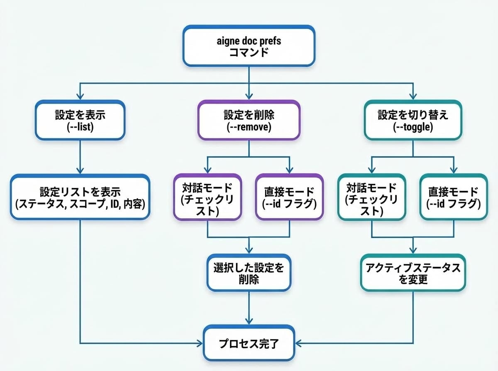

# プリファレンスの管理

AI アシスタントに指示を覚えておいてほしいと思ったことはありませんか？このガイドでは、ドキュメント生成用に保存されたプリファレンスを表示、削除、切り替える方法を説明します。これにより、AI の出力を細かく制御し、プロジェクト固有のスタイルに一貫して従うようにすることができます。

ドキュメントを生成または更新する際、`--feedback` フラグを使用してフィードバックを提供できます。このフィードバックは「プリファレンス」として保存され、将来のセッションで再利用されるため、AI が以前の指示との一貫性を保つことができます。`aigne doc prefs` コマンドは、これらの保存されたプリファレンスを直接管理する方法を提供します。

このガイドでは、保存されたプリファレンスのリスト表示、削除、アクティブ状態の切り替え方法について詳しく説明します。

<!-- DIAGRAM_IMAGE_START:guide:4:3:1765281225 -->

<!-- DIAGRAM_IMAGE_END -->

## 保存されたプリファレンスの表示

保存されているすべてのプリファレンスを確認するには、`--list` フラグを使用します。このコマンドは、各プリファレンスの状態、スコープ、一意の ID、および内容を表示します。

```bash icon=lucide:terminal
aigne doc prefs --list
```

### 出力の理解

リストは、各プリファレンスルールに関する情報を明確に提供するようにフォーマットされています。

*   **Status**: プリファレンスがアクティブか非アクティブかを示します。
    *   `🟢`: アクティブ。このルールはドキュメント生成中に適用されます。
    *   `⚪`: 非アクティブ。ルールは保存されていますが、無視されます。
*   **Scope**: プリファレンスが適用されるコンテキスト（例：`global`, `document`）。
*   **ID**: プリファレンスの一意の識別子で、削除や切り替えに使用されます。
*   **Paths**: プリファレンスが特定のファイルにのみ適用される場合、そのパスがここにリストされます。
*   **Rule Content**: プリファレンスルールのテキスト自体。

**出力例：**

```
# User Preferences

**Format explanation:**
- 🟢 = Active preference, ⚪ = Inactive preference
- [scope] = Preference scope (global, structure, document, translation)
- ID = Unique preference identifier
- Paths = Specific file paths (if applicable)

🟢 [document] pref_a1b2c3d4e5f6a7b8 | Paths: /guides/generating-documentation.md
   Focus on concrete, verifiable facts and information. Avoid using vague or empty words that don't provide measurable or specific d...

⚪ [global] pref_b8a7f6e5d4c3b2a1
   Use a formal and academic tone throughout the documentation.

```

## プリファレンスの削除

プリファレンスが不要になった場合は、`--remove` フラグを使用して永久に削除できます。ID を指定するか、対話型メニューを通じてプリファレンスを削除できます。

### 対話モード

リストからプリファレンスを選択するには、ID を指定せずにコマンドを実行します。これにより対話型プロンプトが開き、削除したい項目にチェックを入れることができます。

```bash icon=lucide:terminal
aigne doc prefs --remove
```

チェックリストが表示され、1つ以上のプリファレンスを選択できます。これは、正しい項目を確実に削除するための推奨される方法です。

### 直接モード

削除したいプリファレンスの一意の ID がすでにわかっている場合は、`--id` フラグを使用して指定できます。どの項目を削除するか確信がある場合は、この方法が高速です。

```bash icon=lucide:terminal
# 単一のプリファレンスを削除
aigne doc prefs --remove --id pref_a1b2c3d4e5f6a7b8

# 複数のプリファレンスを削除
aigne doc prefs --remove --id pref_a1b2c3d4e5f6a7b8 --id pref_b8a7f6e5d4c3b2a1
```

## プリファレンスの切り替え

プリファレンスを永久に削除する代わりに、一時的に有効または無効にすることができます。これは、特定のタスクのためにルールを失うことなく一時停止したい場合に便利です。`--toggle` フラグを使用して、プリファレンスのアクティブ状態を変更します。

### 対話モード

ID を指定せずにコマンドを実行すると、削除コマンドと同様に対話型のチェックリストが起動します。

```bash icon=lucide:terminal
aigne doc prefs --toggle
```

有効化または無効化したいプリファレンスを選択できます。ステータスアイコン（`🟢`/`⚪`）が更新され、新しい状態が反映されます。

### 直接モード

特定のプリファレンスを直接切り替えるには、`--id` フラグを使用します。

```bash icon=lucide:terminal
# 単一のプリファレンスを切り替え
aigne doc prefs --toggle --id pref_a1b2c3d4e5f6a7b8

# 複数のプリファレンスを切り替え
aigne doc prefs --toggle --id pref_a1b2c3d4e5f6a7b8 --id pref_b8a7f6e5d4c3b2a1
```

---

プリファレンスを管理することで、ドキュメント生成プロセスを細かく制御し、出力がプロジェクト固有の要件やスタイルに一貫して合致するように維持できます。