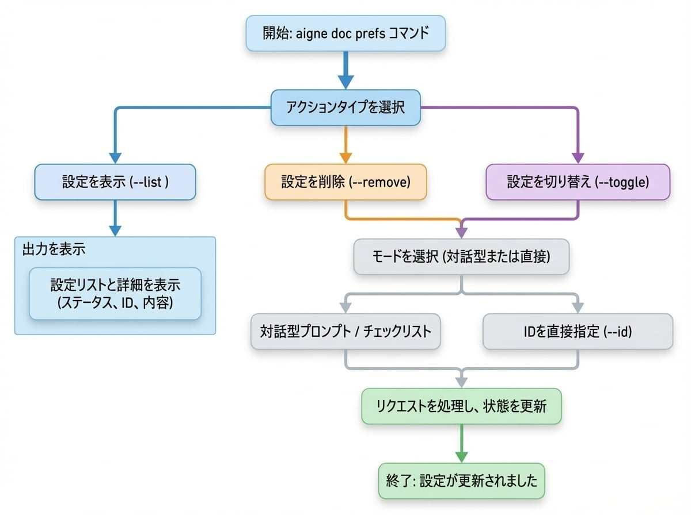

# 設定の管理

AI アシスタントに指示を記憶させたいと思ったことはありませんか？このガイドでは、ドキュメント作成用に保存された設定を表示、削除、切り替える方法を説明し、AI の出力を細かく制御して、プロジェクト固有のスタイルに一貫して従うようにします。

ドキュメントを生成または更新する際に、`--feedback` フラグを使用してフィードバックを提供できます。このフィードバックは「設定」として保存され、将来のセッションで再利用されるため、AI が以前の指示との一貫性を維持します。`aigne doc prefs` コマンドは、これらの保存された設定を直接管理する方法を提供します。

このガイドでは、保存された設定を一覧表示、削除、およびアクティブ状態を切り替える方法について詳しく説明します。以下の図は、これらの設定を管理するためのワークフローを示しています。

<!-- DIAGRAM_IMAGE_START:flowchart:4:3:1765336997 -->

<!-- DIAGRAM_IMAGE_END -->

## 保存された設定の表示

保存されたすべての設定を確認するには、`--list` フラグを使用します。このコマンドは、各設定をそのステータス、スコープ、一意の ID、および内容とともに表示します。

```bash icon=lucide:terminal
aigne doc prefs --list
```

### 出力の理解

リストは、各設定ルールに関する明確な情報を提供するためにフォーマットされています。

*   **ステータス**: 設定がアクティブか非アクティブかを示します。
    *   `🟢`: アクティブ。ルールはドキュメント作成中に適用されます。
    *   `⚪`: 非アクティブ。ルールは保存されていますが、無視されます。
*   **スコープ**: 設定が適用されるコンテキスト (例: `global`、`document`)。
*   **ID**: 設定の一意の識別子で、削除または切り替えに使用されます。
*   **パス**: 設定が特定のファイルにのみ適用される場合、そのパスがここにリストされます。
*   **ルール内容**: 設定ルール自体のテキスト。

**出力例:**

```
# User Preferences

**Format explanation:**
- 🟢 = Active preference, ⚪ = Inactive preference
- [scope] = Preference scope (global, structure, document, translation)
- ID = Unique preference identifier
- Paths = Specific file paths (if applicable)

🟢 [document] pref_a1b2c3d4e5f6a7b8 | Paths: /guides/generating-documentation.md
   Focus on concrete, verifiable facts and information. Avoid using vague or empty words that don't provide measurable or specific d...

⚪ [global] pref_b8a7f6e5d4c3b2a1
   Use a formal and academic tone throughout the documentation.

```

## 設定の削除

設定が不要になった場合は、`--remove` フラグを使用して永久に削除できます。ID を指定するか、インタラクティブメニューを通じて設定を削除できます。

### インタラクティブモード (ベータ)

リストから設定を選択するには、ID を指定せずにコマンドを実行します。これにより、削除したい項目をチェックできるインタラクティブなプロンプトが開きます。

```bash icon=lucide:terminal
aigne doc prefs --remove
```

チェックリストが表示され、1 つ以上の設定を選択できます。これは、正しい項目を確実に削除するための推奨される方法です。

### ダイレクトモード

削除したい設定の一意の ID がすでにわかっている場合は、`--id` フラグを使用してそれらを指定できます。削除する項目が確かな場合は、この方法がより速いです。

```bash icon=lucide:terminal
# 単一の設定を削除
aigne doc prefs --remove --id pref_a1b2c3d4e5f6a7b8

# 複数の設定を削除
aigne doc prefs --remove --id pref_a1b2c3d4e5f6a7b8 --id pref_b8a7f6e5d4c3b2a1
```

## 設定の切り替え

設定を永久に削除する代わりに、一時的に有効または無効にすることができます。これは、特定のタスクのためにルールを失うことなく一時停止したい場合に便利です。`--toggle` フラグを使用して、設定のアクティブ状態を変更します。

### インタラクティブモード (ベータ)

ID を指定せずにコマンドを実行すると、削除コマンドと同様のインタラクティブなチェックリストが起動します。

```bash icon=lucide:terminal
aigne doc prefs --toggle
```

有効化または無効化したい設定を選択できます。ステータスアイコン (`🟢`/`⚪`) が更新され、新しい状態が反映されます。

### ダイレクトモード

特定の設定を直接切り替えるには、`--id` フラグを使用します。

```bash icon=lucide:terminal
# 単一の設定を切り替え
aigne doc prefs --toggle --id pref_a1b2c3d4e5f6a7b8

# 複数の設定を切り替え
aigne doc prefs --toggle --id pref_a1b2c3d4e5f6a7b8 --id pref_b8a7f6e5d4c3b2a1
```

---

設定を管理することで、ドキュメント作成プロセスを細かく制御し、出力がプロジェクトの特定の要件とスタイルに一貫して合致するようにすることができます。