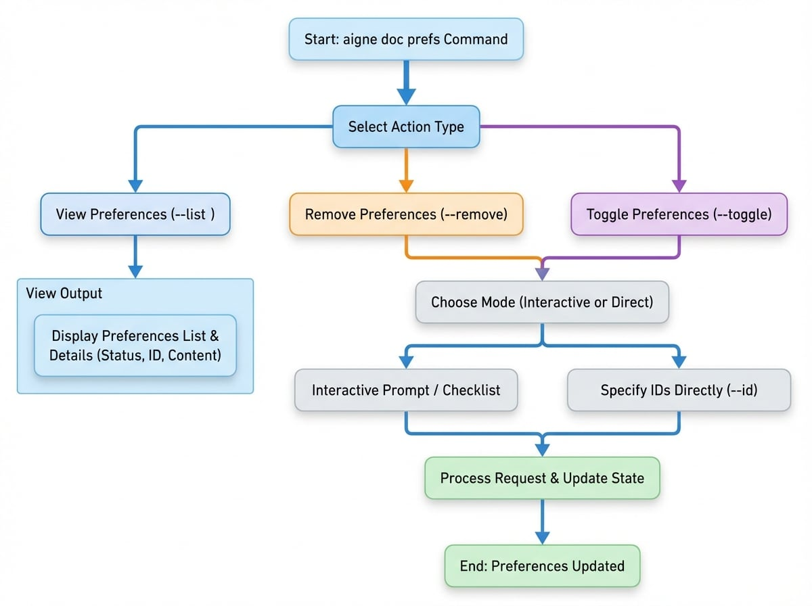

# Manage Preferences

Have you ever wished your AI assistant would remember your instructions? This guide explains how to view, remove, and toggle your saved preferences for document creation, giving you fine-grained control over the AI's output and ensuring it consistently follows your project's specific style.

When you generate or update documents, you can provide feedback using the `--feedback` flag. This feedback is saved as a "preference" to be reused in future sessions, ensuring the AI maintains consistency with your previous instructions. The `aigne doc prefs` command provides a direct way to manage these saved preferences.

This guide details how to list, remove, and toggle the active status of your saved preferences. The diagram below illustrates the workflow for managing these preferences.

<!-- DIAGRAM_IMAGE_START:flowchart:4:3:1765336997 -->

<!-- DIAGRAM_IMAGE_END -->

## Viewing Saved Preferences

To review all saved preferences, use the `--list` flag. This command displays each preference with its status, scope, unique ID, and content.

```bash icon=lucide:terminal
aigne doc prefs --list
```

### Understanding the Output

The list is formatted to provide clear information about each preference rule:

*   **Status**: Indicates if a preference is active or inactive.
    *   `🟢`: Active. The rule will be applied during documentation creation.
    *   `⚪`: Inactive. The rule is saved but will be ignored.
*   **Scope**: The context in which the preference applies (e.g., `global`, `document`).
*   **ID**: A unique identifier for the preference, used for removing or toggling.
*   **Paths**: If the preference applies only to specific files, their paths are listed here.
*   **Rule Content**: The text of the preference rule itself.

**Example Output:**

```
# User Preferences

**Format explanation:**
- 🟢 = Active preference, ⚪ = Inactive preference
- [scope] = Preference scope (global, structure, document, translation)
- ID = Unique preference identifier
- Paths = Specific file paths (if applicable)

🟢 [document] pref_a1b2c3d4e5f6a7b8 | Paths: /guides/generating-documentation.md
   Focus on concrete, verifiable facts and information. Avoid using vague or empty words that don't provide measurable or specific d...

⚪ [global] pref_b8a7f6e5d4c3b2a1
   Use a formal and academic tone throughout the documentation.

```

## Removing Preferences

When a preference is no longer needed, you can permanently delete it using the `--remove` flag. You can remove preferences either by specifying their IDs or through an interactive menu.

### Interactive Mode (Beta)

To select preferences from a list, run the command without any IDs. This will open an interactive prompt where you can check the items you wish to delete.

```bash icon=lucide:terminal
aigne doc prefs --remove
```

A checklist will appear, allowing you to select one or more preferences. This is the recommended method for ensuring you remove the correct items.

### Direct Mode

If you already know the unique IDs of the preferences you want to remove, you can specify them using the `--id` flag. This is faster if you are certain about which items to delete.

```bash icon=lucide:terminal
# Remove a single preference
aigne doc prefs --remove --id pref_a1b2c3d4e5f6a7b8

# Remove multiple preferences
aigne doc prefs --remove --id pref_a1b2c3d4e5f6a7b8 --id pref_b8a7f6e5d4c3b2a1
```

## Toggling Preferences

Instead of permanently deleting a preference, you can temporarily enable or disable it. This is useful when you want to suspend a rule for a specific task without losing it. Use the `--toggle` flag to change a preference's active status.

### Interactive Mode (Beta)

Running the command without IDs will launch an interactive checklist, similar to the remove command.

```bash icon=lucide:terminal
aigne doc prefs --toggle
```

You can select the preferences you wish to activate or deactivate. The status icon (`🟢`/`⚪`) will update to reflect the new state.

### Direct Mode

To toggle specific preferences directly, use the `--id` flag.

```bash icon=lucide:terminal
# Toggle a single preference
aigne doc prefs --toggle --id pref_a1b2c3d4e5f6a7b8

# Toggle multiple preferences
aigne doc prefs --toggle --id pref_a1b2c3d4e5f6a7b8 --id pref_b8a7f6e5d4c3b2a1
```

---

By managing your preferences, you can maintain fine-grained control over the document creation process, ensuring that the output consistently aligns with your project's specific requirements and style.
