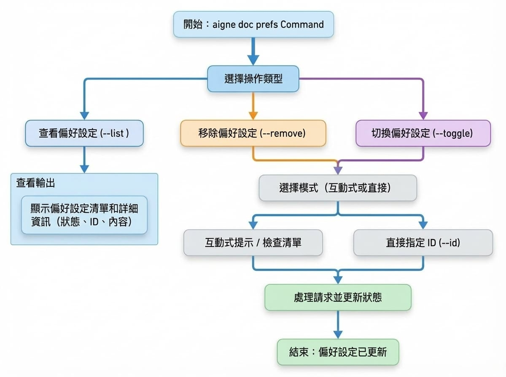

# 管理偏好設定

您是否曾希望您的 AI 助理能記住您的指示？本指南將說明如何檢視、移除和切換您儲存的文件建立偏好設定，讓您能精細控制 AI 的輸出，並確保其始終遵循您專案的特定風格。

當您生成或更新文件時，可以使用 `--feedback` 旗標提供回饋。此回饋會被儲存為「偏好設定」，以便在未來的會話中重複使用，確保 AI 與您先前的指示保持一致性。`aigne doc prefs` 指令提供了一種直接管理這些已儲存偏好設定的方法。

本指南詳細說明如何列出、移除及切換已儲存偏好設定的啟用狀態。下圖說明了管理這些偏好設定的工作流程。

<!-- DIAGRAM_IMAGE_START:flowchart:4:3:1765336997 -->

<!-- DIAGRAM_IMAGE_END -->

## 檢視已儲存的偏好設定

若要檢閱所有已儲存的偏好設定，請使用 `--list` 旗標。此指令會顯示每個偏好設定及其狀態、範圍、唯一 ID 和內容。

```bash icon=lucide:terminal
aigne doc prefs --list
```

### 理解輸出內容

列表的格式旨在提供關於每個偏好設定規則的清晰資訊：

*   **狀態（Status）**：表示偏好設定是啟用或停用。
    *   `🟢`：啟用。此規則將在文件建立期間應用。
    *   `⚪`：停用。此規則已儲存但將被忽略。
*   **範圍（Scope）**：偏好設定應用的情境（例如：`global`、`document`）。
*   **ID**：偏好設定的唯一識別碼，用於移除或切換狀態。
*   **路徑（Paths）**：如果偏好設定僅適用於特定檔案，此處會列出其路徑。
*   **規則內容（Rule Content）**：偏好設定規則本身的文字。

**輸出範例：**

```
# 使用者偏好設定

**格式說明：**
- 🟢 = 啟用的偏好設定，⚪ = 停用的偏好設定
- [scope] = 偏好設定範圍 (global, structure, document, translation)
- ID = 唯一的偏好設定識別碼
- Paths = 特定檔案路徑 (若適用)

🟢 [document] pref_a1b2c3d4e5f6a7b8 | Paths: /guides/generating-documentation.md
   Focus on concrete, verifiable facts and information. Avoid using vague or empty words that don't provide measurable or specific d...

⚪ [global] pref_b8a7f6e5d4c3b2a1
   Use a formal and academic tone throughout the documentation.

```

## 移除偏好設定

當不再需要某個偏好設定時，您可以使用 `--remove` 旗標將其永久刪除。您可以透過指定其 ID 或透過互動式選單來移除偏好設定。

### 互動模式（Beta）

若要從列表中選取偏好設定，請在不加任何 ID 的情況下執行指令。這將開啟一個互動式提示，您可以在其中勾選希望刪除的項目。

```bash icon=lucide:terminal
aigne doc prefs --remove
```

接著會出現一個清單，讓您選取一個或多個偏好設定。這是建議的方法，以確保您移除正確的項目。

### 直接模式

如果您已經知道要移除的偏好設定的唯一 ID，您可以使用 `--id` 旗標來指定它們。如果您確定要刪除哪些項目，這種方式會更快。

```bash icon=lucide:terminal
# 移除單一偏好設定
aigne doc prefs --remove --id pref_a1b2c3d4e5f6a7b8

# 移除多個偏好設定
aigne doc prefs --remove --id pref_a1b2c3d4e5f6a7b8 --id pref_b8a7f6e5d4c3b2a1
```

## 切換偏好設定

您可以暫時啟用或停用偏好設定，而不是永久刪除它。當您想為特定任務暫停某個規則但又不想失去它時，這個功能很有用。使用 `--toggle` 旗標來變更偏好設定的啟用狀態。

### 互動模式（Beta）

在不加 ID 的情況下執行此指令將啟動一個互動式清單，類似於移除指令。

```bash icon=lucide:terminal
aigne doc prefs --toggle
```

您可以選取希望啟用或停用的偏好設定。狀態圖示（`🟢`/`⚪`）將會更新以反映新的狀態。

### 直接模式

若要直接切換特定的偏好設定，請使用 `--id` 旗標。

```bash icon=lucide:terminal
# 切換單一偏好設定
aigne doc prefs --toggle --id pref_a1b2c3d4e5f6a7b8

# 切換多個偏好設定
aigne doc prefs --toggle --id pref_a1b2c3d4e5f6a7b8 --id pref_b8a7f6e5d4c3b2a1
```

---

透過管理您的偏好設定，您可以對文件建立過程進行精細控制，確保輸出始終符合您專案的特定要求和風格。