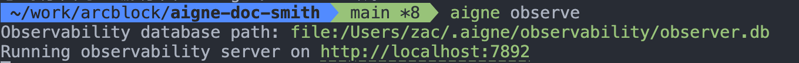
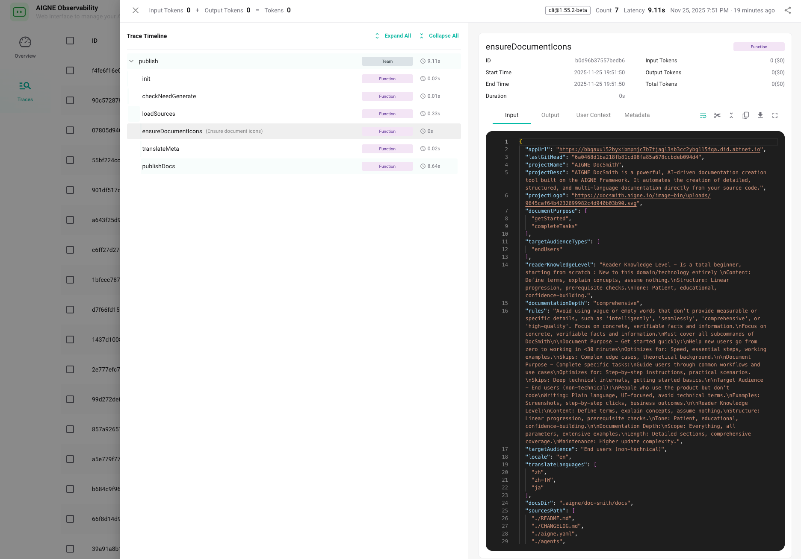

# Troubleshooting

This guide helps you diagnose and fix common issues when using AIGNE DocSmith. If you encounter problems during generation, publishing, or configuration, please check the solutions for the following scenarios.

---

## Configuration Issues

### Issue 1: Configuration File Format Error

**Error messages:**
```
Error: Failed to parse config file: Implicit map keys need to be followed by map values at line 112, column 1:

lastGitHead: d9d2584f23aee352485f369f60142949db601283
appUrl： https://docsmith.aigne.io
```

```
Error: Failed to parse config file: Map keys must be unique at line 116, column 1:

docsDir: .aigne/doc-smith/docs
appUrl: https://docsmith.aigne.io
^
```

**Possible causes:** YAML syntax errors in the configuration file, common issues include:
- Using tabs instead of spaces for indentation
- Using Chinese colons（：）instead of English colons（:）
- Missing necessary quotes
- Duplicate configuration items

**Solutions:**
1. Check the line number in the error message to locate the problem
2. Verify that the indentation is correct (use spaces, not tabs)
3. Ensure colons are English half-width colons（:）, not Chinese full-width colons（：）
4. Use an online YAML validator to check syntax
5. After fixing, run `aigne doc publish` again

---

> **Tip:** In addition to fixing configuration file format errors, if certain parameters are not correctly configured, the system will automatically use default values, which will not affect basic functionality.

## Generation Issues

### Issue 2: Generated Content Doesn't Meet Expectations

**You may encounter:**
- Generated content tone doesn't match your requirements
- Document structure doesn't match your expectations
- Missing some important information

**Possible causes:**
1. The `rules` description in the configuration is not detailed or clear enough
2. `targetAudienceTypes` settings don't match the actual target audience
3. Too few or irrelevant reference documents in `sourcesPath`

**How to fix:**
1. **Enrich `rules`:** Add detailed guidance in `config.yaml`:
   ```yaml
   rules: |
     ### Documentation Structure Requirements
     1. Each document must include:
        * Clear title and overview
        * Step-by-step instructions
        * Code examples where applicable
        * Troubleshooting section
     
     ### Content Tone
     - Use clear, concise language
     - Include concrete data and examples
     - Avoid marketing terminology
     - Focus on actionable information
   ```

2. **Adjust audience:** Ensure `targetAudienceTypes` matches the actual audience:
   ```yaml
   targetAudienceTypes:
     - endUsers      # For end users
     - developers     # For technical audience
   ```

3. **Add more sources:** Include relevant documents in `sourcesPath`:
   ```yaml
   sourcesPath:
     - ./README.md
     - ./docs
     - ./CHANGELOG.md
     - ./src
     - ./package.json
   ```

---

### Issue 3: Low Quality or Missing Images

**You may encounter:**
- Images in generated documentation are not clear enough
- Expected images don't appear

**Cause:** The `media.minImageWidth` setting value is too high, filtering out some images.

**How to fix:**
1. Open the `config.yaml` file and find the `media` configuration:
   ```yaml
   media:
     minImageWidth: 800  # Current threshold
   ```

2. Adjust this value according to your needs:
   - **400-600**: Will include more images, but may include some lower quality images
   - **600-800**: Balanced quality and quantity (recommended setting)
   - **800-1000**: Only high-quality images, fewer in number

3. After saving the file, run the update command:
   ```bash
   aigne doc update
   ```

---

### Issue 4: Missing or Incomplete Documentation

**You may encounter:**
- Some expected documents are not generated
- Generated documents are incomplete

**Possible causes:**
1. `sourcesPath` doesn't include all necessary source files
2. Source files are not accessible or have permission issues
3. `documentationDepth` is set too low

**How to fix:**
1. **Check source paths:** Verify all necessary files are included:
   ```yaml
   sourcesPath:
     - ./README.md
     - ./src              # Include source code directories
     - ./docs             # Include existing documentation
     - ./package.json      # Include configuration files
   ```

2. **Increase documentation depth:** If you need comprehensive documentation:
   ```yaml
   documentationDepth: comprehensive  # Instead of essentialOnly
   ```

3. **Verify file permissions:** Ensure DocSmith has read access to all files in `sourcesPath`

---

## Translation Issues

### Issue 5: Translation Fails or Produces Poor Quality

**You may encounter:**
- Translation command fails
- Translated content has poor quality or errors

**Possible causes:**
1. `locale` and `translateLanguages` have conflicting settings
2. Source documentation has syntax errors
3. Network issues during translation

**How to fix:**
1. **Check language settings:** Ensure `translateLanguages` doesn't include the same language as `locale`:
   ```yaml
   locale: en
   translateLanguages:
     - zh        # OK
     - ja        # OK
     # - en      # ❌ Don't include locale language
   ```

2. **Fix source documentation:** Ensure source documents are valid before translation:
   ```bash
   # First verify source documents are correct
   aigne doc create
   
   # Then translate
   aigne doc translate
   ```

3. **Retry translation:** If network issues occur, simply run the command again:
   ```bash
   aigne doc translate
   ```

---

## Publishing Issues

### Issue 6: Publishing Fails with Invalid URL Error

**Error message:**
```
Error: ⚠️  The provided URL is not a valid ArcBlock-powered website

💡 Solution: To host your documentation, you can get a website from the ArcBlock store:
```

**Cause:** The `appUrl` in the configuration is empty or points to an invalid website address.

**How to fix:**
Set the correct deployment address in `config.yaml`:
```yaml
# Enter your website address
appUrl: https://your-site.user.aigne.io

# If you don't have a website yet, you can leave this empty for now
# appUrl: ""
```

Alternatively, you can specify the URL when publishing:
```bash
aigne doc publish --appUrl https://your-docs-website.com
```

---

### Issue 7: Publishing Fails with Authorization Error

**Error messages:**
```
❌ Publishing failed due to an authorization error:
💡 Please run aigne doc clear to reset your credentials and try again.
```

```
❌ Publishing failed due to an authorization error:
💡 You're not the creator of this document (Board ID: docsmith). You can change the board ID and try again.
💡  Or run aigne doc clear to reset your credentials and try again.
```

**Cause:** Your login credentials have expired or you don't have permission to publish to the specified board.

**How to fix:**
Run the following commands in order:
```bash
# First clear old authorization information
aigne doc clear

# Then republish, the system will prompt you to log in again
aigne doc publish
```

When running `aigne doc clear`, select to clear authentication tokens. Afterward, run `aigne doc publish` again and you will be prompted to re-authenticate.

---

### Issue 8: Publishing Fails Due to Network Issues

**Error message:**
```
❌ Could not connect to: https://your-site.com

Possible causes:
• There may be a network issue.
• The server may be temporarily unavailable.
• The URL may be incorrect.

Suggestion: Please check your network connection and the URL, then try again.
```

**How to fix:**
1. **Check network connection:** Ensure your network can access the target URL
2. **Verify URL:** Confirm the `appUrl` is correct and accessible
3. **Retry:** Network issues are often temporary, try again after a few moments:
   ```bash
   aigne doc publish
   ```

---

## How to Recover

### Method 1: Using Git to Restore

If you use Git to manage your code, you can quickly restore to a previously working configuration:

```bash
# Stash current changes
git stash
```

Then regenerate documentation:
```bash
aigne doc create
```

> **Tip:** If you want to restore the stashed changes later, you can run `git stash pop`

---

### Method 2: Clear and Regenerate

If you encounter issues that cannot be located, you can clear all generated files and regenerate from scratch:

```bash
# Clear all generated files, then regenerate
aigne doc clear && aigne doc create
```

> **Note:** This will delete all generated content, but will not affect your configuration file. After execution, the system will regenerate documentation based on the current configuration.

---

### Method 3: Reset Configuration

If configuration issues persist, you can reset the configuration file:

```bash
# Clear configuration (select config file when prompted)
aigne doc clear

# Then reinitialize
aigne doc init
```

> **Warning:** This will remove your current configuration. Make sure to back up important settings before proceeding.

---

## Best Practices

Here are some practical suggestions to help you avoid common issues:

1. **Save modification history:** If using Git, commit after each configuration file modification so you can easily revert to previous versions if problems occur
2. **Backup before modifying:** Before modifying important configurations, copy the configuration file as a backup, just in case
3. **Test immediately after modification:** After each configuration modification, immediately run `aigne doc create` or `aigne doc update` to test, so problems can be discovered early
4. **Check format correctness:** After modifying YAML files, use online tools to check if the format has errors
5. **Start simple:** Start with the simplest configuration, confirm everything works, then gradually add more complex features
6. **Record your modifications:** Simply record what you modified each time and why, making it easier to find the cause when problems occur later
7. **Keep sources updated:** Regularly update `sourcesPath` to include new source files and documentation
8. **Review generated content:** After generation, review the output to ensure it meets expectations before publishing

---

## Getting More Help

If the above methods cannot solve your problem, you can try:

1. **Consult configuration documentation:** Check [Configuration Reference](./configuration.md) to understand detailed explanations of each configuration item

2. **Check command documentation:** Refer to command documentation to understand detailed usage of commands

3. **Review error logs:** Carefully read the error messages displayed in the terminal, which usually contain specific hints

4. **Use AIGNE Observability:** Use the AIGNE Observability tool described below to get detailed execution records

5. **Seek community help:** Visit [AIGNE Community](https://community.arcblock.io/discussions/boards/aigne) to ask questions, other users or developers may help you

---

## Using AIGNE Observability for Troubleshooting

When you encounter complex issues that require in-depth troubleshooting, or need to report problems to the community, you can use **AIGNE Observability**. It records every step of the execution process in detail, helping you or technical support quickly locate the problem.

### Starting the Observability Server

Run the following command to start the local Observability server:

```bash Start Observability Server icon=lucide:terminal
aigne observe
```

You will see output showing:
- Database path: Where tracking data is saved
- Server address: Open this address in your browser to view the Observability dashboard



### Viewing Execution Records

1. **Open the dashboard:** Click the server address shown in the output, or open it in your browser

2. **View operation records:** The dashboard will display all DocSmith operations, including:
   - Input and output data
   - Time spent on each step
   - Executed operation steps and results
   - Detailed error messages



### Using Observability to Report Issues

When reporting problems to the community:

1. **Capture tracking:** Keep the Observability server running during the problematic operation
2. **Export tracking data:** Export relevant execution records from the dashboard
3. **Report the issue:** Visit [AIGNE Community](https://community.arcblock.io/discussions/boards/aigne) and include:
   - Problem description
   - Reproduction steps
   - Exported tracking file
   - Your configuration (if relevant)

> **Tip:** Tracking records contain complete information about DocSmith execution, including every operation and result. Providing this information to technical support or the community can greatly improve problem resolution efficiency.
