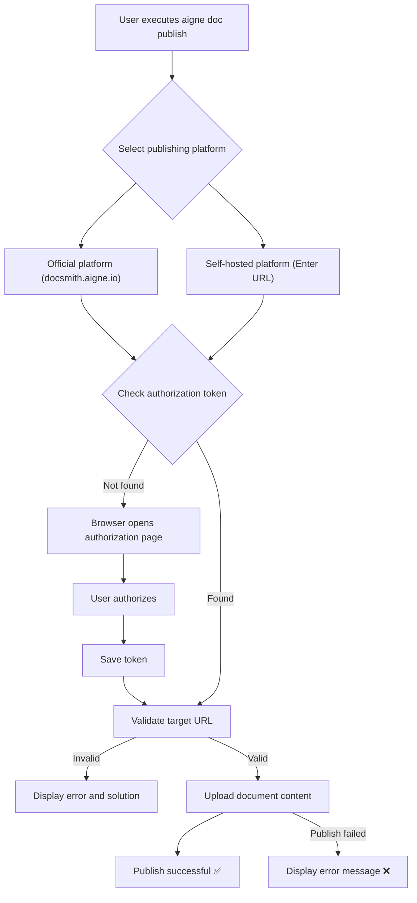

# Publishing Documents

After generating your documentation, the next step is to share it with your target audience. AIGNE DocSmith provides the `publish` command, allowing you to easily publish your documentation to a public platform or your own private website.

## Publishing Process

With a simple interactive command, you can specify the publishing destination and make your documentation public.

Run the following command to start the publishing wizard:

```bash
aigne doc publish
```

After executing the command, you will be prompted to select a publishing platform.


### Publishing Platform Options

You can choose the most suitable platform based on the nature of your project:

1.  **Official Platform (docsmith.aigne.io)**
    *   **Description**: This is a free, public platform, ideal for open-source projects or any user wishing to share their documentation publicly.
    *   **Advantages**: Quick to publish with no configuration required.
    *   **Note**: Content published to this platform will be publicly visible.

2.  **Self-Hosted Platform**
    *   **Description**: If you have your own deployed instance of Discuss Kit, you can choose this option to publish the documentation to your own website.
    *   **Advantages**: Complete control over your documentation content and access permissions.
    *   **Action**: After selecting this option, you will be prompted to enter your website's URL. If you haven't deployed it yet, you can refer to the [Discuss Kit documentation](https://www.aigne.io/store/blocklet/z8ia2v13y1oJ4qg3rRk6wNAhE45s2CWJ513k9) to get started.

### Direct Publishing

If you want to skip the interactive selection, you can directly specify the publishing address using the `--appUrl` parameter:

```bash
# Publish to your own Discuss Kit instance
aigne doc publish --appUrl https://your-discuss-kit-instance.com
```

## Authorization and Authentication

When publishing to a platform for the first time, DocSmith requires your authorization. This process is automatic and designed to ensure secure publishing.

1.  **Token Check**: The system first checks if an authorization token (Access Token) is already stored locally.
2.  **Browser Authorization**: If no token is found, the system will automatically open a browser window to guide you through logging in and authorizing AIGNE DocSmith to access your Discuss Kit platform.
3.  **Save Token**: Once authorization is successful, the access token will be securely saved in the local configuration file `~/.aigne/doc-smith-connected.yaml`. It will be used automatically for subsequent publications, eliminating the need for repeated authorization.

## Publishing Workflow

The diagram below illustrates the complete workflow of the `aigne doc publish` command, from initiating the command to successfully publishing the documentation.



## Configuration Saving

After the first successful publication, DocSmith will automatically save your selected `appUrl` and the system-generated `boardId` (document board ID) to the project's `aigne-doc.yaml` configuration file. This ensures that subsequent updates are published to the same location, simplifying maintenance.

---

Now that you have learned how to publish your documentation, the next step is to explore how to [refine the document structure](./core-features-refine-structure.md) by providing feedback to better meet your expectations.