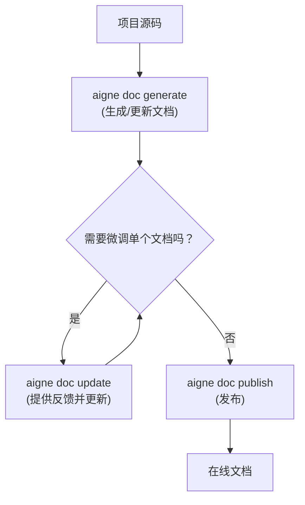

# 核心功能

AIGNE DocSmith 将复杂的文档工作流简化为几个核心命令。通过这些指令，您可以轻松地完成从分析代码、生成内容、持续优化到最终发布的完整流程。本节将概述这些关键功能，并引导您深入了解每个命令的详细用法。

以下是使用 DocSmith 管理文档的典型工作流程：

## 生成文档

使用 `aigne doc generate` 命令，您可以一键启动整个文档的创建过程。DocSmith 会自动分析您的代码库，规划文档结构，并生成所有页面的初始内容。此命令是您开始文档工作的起点，也用于在代码发生重大变化后进行全量更新。

要了解如何使用智能自动配置和强制重新生成选项，请参阅 [生成文档](./core-features-generate-docs.md) 的详细指南。

## 更新单个文档

当您只需要对某一篇具体的文档进行微调或优化时，`aigne doc update` 命令就派上了用场。它允许您选择特定的文档页面，并提供反馈来指导 AI 重新生成内容，从而实现精确、高效的迭代，而无需重新生成整个项目。

学习如何通过交互式菜单或直接指定路径来优化您的内容，请访问 [更新单个文档](./core-features-update-document.md)。

## 发布文档

文档编写完成后，分享是关键一步。`aigne doc publish` 命令可以帮助您轻松地将生成的文档发布到 Discuss Kit 平台。您可以选择发布到官方公共平台 [docsmith.aigne.io](https://docsmith.aigne.io/app/)，或部署到您自己的私有实例中。

有关发布流程和平台选择的详细信息，请查看 [发布文档](./core-features-publish-docs.md)。

## 优化文档结构

DocSmith 的智能结构规划非常出色，但您可能仍希望根据特定需求进行调整。通过在 `aigne doc generate` 命令中加入 `--feedback` 参数，您可以指导 AI 优化整体文档结构，例如增删章节、调整层级关系，使其更完美地匹配您的项目。

要掌握如何通过反馈来塑造最理想的文档大纲，请阅读 [优化文档结构](./core-features-refine-structure.md)。

---

现在您已经对 DocSmith 的核心工作流有了初步了解。我们建议您从 [生成文档](./core-features-generate-docs.md) 开始，亲身体验自动化文档创建的过程。