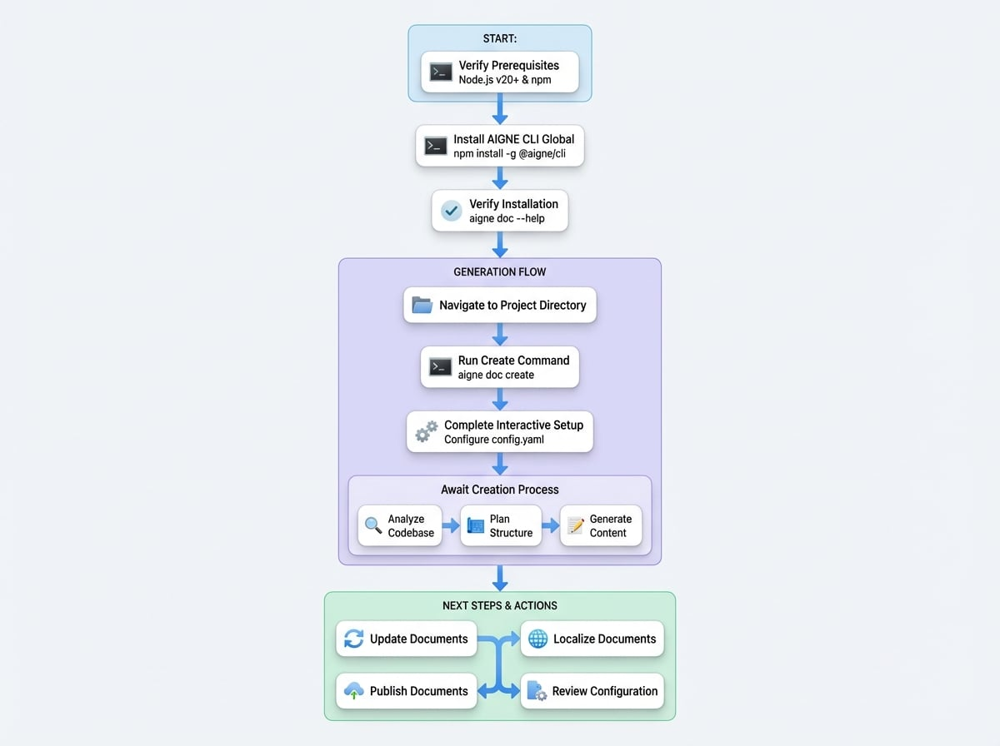

# 入门指南

本指南提供了安装 AIGNE DocSmith 并生成您的第一套文档的直接、分步流程。该过程旨在几分钟内完成，让您只需最少的设置即可从项目文件生成文档。

下图说明了从安装到生成的关键步骤：

<!-- DIAGRAM_IMAGE_START:guide:4:3 -->

<!-- DIAGRAM_IMAGE_END -->

## 先决条件

在继续安装之前，请确保您的系统满足以下要求：

*   **Node.js**：需要 20 或更高版本。AIGNE DocSmith 使用 Node.js 安装中包含的 Node 包管理器 (npm) 进行安装。要安装 Node.js，请访问官方 [Node.js 网站](https://nodejs.org/) 并按照您操作系统的说明进行操作。您可以通过打开终端并运行 `node -v` 和 `npm -v` 来验证安装。

开始时无需 API 密钥。默认情况下，DocSmith 使用 AIGNE Hub 服务进行 AI 驱动的生成，无需直接配置即可访问各种大型语言模型。

## 安装

该工具作为 AIGNE 命令行界面 (CLI) 的一部分分发。安装涉及两个主要步骤。

### 步骤 1：安装 AIGNE CLI

要在您的系统上全局安装 AIGNE CLI，请在终端中执行以下命令。这使得 `aigne` 命令可以在任何目录中访问。

```bash 安装 AIGNE CLI icon=lucide:terminal
npm install -g @aigne/cli
```

### 步骤 2：验证安装

安装完成后，您可以通过运行文档工具的帮助命令来确认其是否成功。

```bash 验证安装 icon=lucide:terminal
aigne doc --help
```

成功安装将显示可用的 DocSmith 命令及其选项的列表。

## 生成您的第一份文档

按照以下步骤分析您的项目并生成一套完整的文档。

### 步骤 1：导航到您的项目目录

打开您的终端，使用 `cd` 命令将当前目录更改为您打算记录的项目的根目录。

```bash 更改目录 icon=mdi:folder-open
cd /path/to/your/project
```

### 步骤 2：运行生成命令

执行 `generate` 命令。这个单一命令启动了从项目分析到内容生成的整个文档创建过程。

```bash 运行生成命令 icon=lucide:terminal
aigne doc create
```

### 步骤 3：完成交互式设置

当您在项目中首次运行 `generate` 命令时，DocSmith 会启动一次性的交互式设置过程。您将被引导通过一系列问题来配置文档的偏好，例如其用途、目标受众和主要语言。


这些设置将保存到位于 `.aigne/doc-smith` 目录中的 `config.yaml` 文件中，您可以随时手动修改该文件。

### 步骤 4：等待生成

设置完成后，DocSmith 将自动执行以下操作：

1.  **分析代码库**：扫描您的源文件以了解项目的结构和逻辑。
2.  **规划结构**：为文档创建一个逻辑大纲，定义章节和主题。
3.  **生成内容**：根据分析和您指定的配置编写文档。

完成后，将显示一条确认消息。生成的文件将位于设置期间指定的输出目录中，默认为 `.aigne/doc-smith/docs`。


## 接下来做什么？

您现在已经成功生成了您的第一套文档。以下是管理和增强文档的常见后续步骤：

<x-cards data-columns="2">
  <x-card data-title="更新文档" data-icon="lucide:refresh-cw" data-href="/guides/updating-documentation">
    修改或重新创建文档的特定部分，以反映代码更改或采纳新反馈。
  </x-card>
  <x-card data-title="本地化文档" data-icon="lucide:languages" data-href="/guides/translating-documentation">
    将您的文档本地化为 12 种支持的语言中的任何一种，包括中文、西班牙语和德语。
  </x-card>
  <x-card data-title="发布文档" data-icon="lucide:rocket" data-href="/guides/publishing-your-docs">
    将您的文档在线发布，供您的团队或公众访问。
  </x-card>
  <x-card data-title="审阅配置" data-icon="lucide:settings" data-href="/configuration/initial-setup">
    审阅和修改在初始设置期间创建的 `config.yaml` 文件，以调整您的偏好。
  </x-card>
</x-cards>
