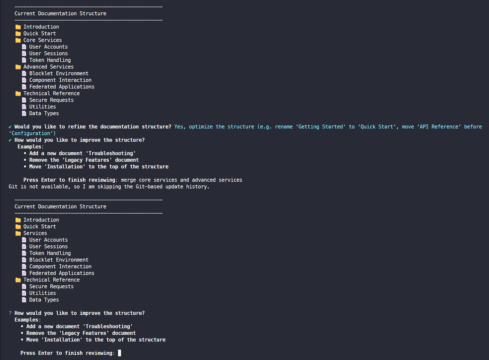
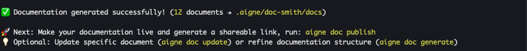

# 创建文档

本指南将引导您使用单个命令，从项目的源文件创建一套完整的文档。该过程设计得简单直接，从初始分析到最终内容创建，并包含一个交互式审查步骤，以确保输出的结构完全符合您的需求。

## 创建过程

当您运行 `aigne doc create` 时，该工具会执行一系列步骤来分析您的项目并生成文档。本节对该工作流程进行了事实性的分解。

### 步骤 1：启动命令

该过程始于在您项目的根目录中运行 `generate` 命令。此命令会协调从分析到内容创建的整个工作流程。

```bash Terminal icon=lucide:terminal
aigne doc create
```

为提高效率，您也可以使用别名 `gen` 或 `g`。

### 步骤 2：源代码分析与结构规划

启动后，DocSmith 会对您项目的源文件进行分析。它会识别代码库中的组件、逻辑和关系，以提出一个初始的文档结构。该计划会概述一个逻辑化的文档层级，例如“概述”、“入门指南”和“API 参考”，这些都是根据检测到的内容量身定制的。

### 步骤 3：交互式结构审查

在初步规划好结构后，它会显示在终端中供您审查。此步骤允许您在任何内容被写入之前，批准或修改文档的组织结构。

您有两个选择：
1.  **接受结构：** 如果提议的组织结构令人满意，您可以批准它以继续进行。
2.  **提供反馈以进行优化：** 您可以输入纯文本指令来修改结构。



反馈示例包括：
*   “将‘Getting Started’重命名为‘快速入门’。”
*   “添加一个名为‘故障排除’的新文档。”
*   “将‘API 参考’移动到‘指南’部分下。”

该工具会根据您的反馈修订结构，并再次呈现给您审查。这个迭代过程会持续进行，直到结构满足您的要求。

### 步骤 4：内容创建

一旦文档结构最终确定并获得批准，DocSmith 就会开始为计划中的每个文档创建内容。它会处理相关的源文件，以编写详细的解释和代码示例。此操作会针对每个文档执行，确保按照批准的结构实现完整覆盖。

### 步骤 5：完成

所有文档创建完毕后，终端会显示一条确认消息。输出文件会保存到您配置中指定的目录，默认为 `.aigne/doc-smith/docs`。



## 命令选项

`generate` 命令包含可选标志以控制其行为。这些标志允许在生成过程中执行更具体的操作。

| 选项 | 描述 |
| :--- | :--- |
| `--forceRegenerate` | 从源文件重建所有文档，覆盖任何现有文档。这对于在代码发生重大变更后进行完全刷新非常有用。 |
| `--glossary <path>` | 指定词汇表文件的路径（例如 `@glossary.md`）。使用词汇表可确保关键术语在整个文档中的使用保持一致。 |

### 示例：强制重新生成

要舍弃现有文档并从头开始生成一套新的文档，请使用 `--forceRegenerate` 标志。

```bash Terminal icon=lucide:terminal
aigne doc create --forceRegenerate
```

### 示例：使用词汇表

为保持术语的一致性，请提供词汇表文件的路径。

```bash Terminal icon=lucide:terminal
aigne doc create --glossary @./project-glossary.md
```

## 摘要

本指南详细介绍了创建一套新文档的系统流程。该工作流程从命令启动和源分析开始，经过交互式结构审查，最后进行内容创建。

在创建文档后，您可以继续[更新现有文档](./guides-updating-documentation.md)或[发布文档](./guides-publishing-your-docs.md)。
