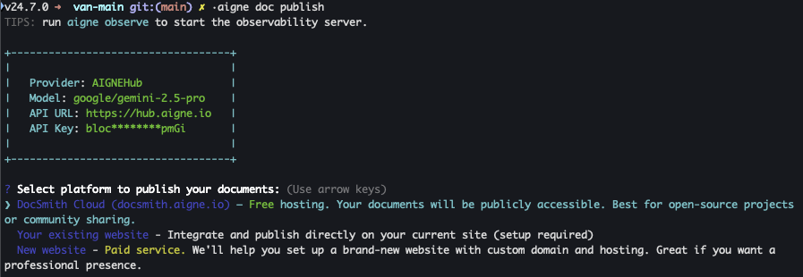

# ドキュメント公開

ドキュメントが生成されたら、最後のステップはそれをオンラインで利用可能にすることです。このドキュメントでは、`aigne doc publish` コマンドを使用してドキュメントを公開し、読者がアクセスできるようにする手順を段階的に説明します。

## publish コマンド

`aigne doc publish` コマンドは、生成されたドキュメントファイルを Web サービスにアップロードし、ユーザーが Web ブラウザで表示できるようにします。効率化のために、メインコマンドまたはその短いエイリアスを使用できます。

```bash コマンドエイリアス icon=lucide:terminal
# フルコマンド
aigne doc publish

# 短いエイリアス
aigne doc pub

# さらに短いエイリアス
aigne doc p
```

このコマンドを初めて実行すると、インタラクティブなセットアッププロセスが開始され、ドキュメントの公開プラットフォームを選択するよう案内されます。



## 公開オプション

このツールは、ドキュメントをホストするためのいくつかの宛先を提供します。インタラクティブなセットアップ中に、以下の選択肢が表示されます。

### 1. DocSmith Cloud（無料ホスティング）

このオプションは、AIGNE が提供する無料の公開ホスティングサービスである `docsmith.aigne.io` にドキュメントを公開します。

*   **最適な用途**: オープンソースプロジェクト、個人ポートフォリオ、または一般公開を目的としたあらゆるドキュメント。
*   **コスト**: 無料。
*   **結果**: ドキュメントは公開 URL でホストされ、公開成功時にその URL が提供されます。

### 2. 既存のウェブサイト（セルフホスト）

このオプションを使用すると、すでに所有・運営しているウェブサイトにドキュメントを公開できます。これには、ドキュメントサイトに必要なバックエンドおよびフロントエンドコンポーネントを提供する Discuss Kit の独自のインスタンスを実行する必要があります。

*   **最適な用途**: 既存の企業ウェブサイト、製品ポータル、または個人のドメインにドキュメントを直接統合し、完全に管理する場合。
*   **要件**: 独自のホスティング環境が必要です。
*   **手順**:
    1.  プロンプトで「Your existing website」オプションを選択します。
    2.  ウェブサイトの完全な URL（例：`https://docs.your-company.com`）を入力します。
    3.  独自のドキュメントウェブサイトをセットアップするには、公式ストアから Discuss Kit インスタンスを入手できます：[https://www.web3kit.rocks/discuss-kit](https://www.web3kit.rocks/discuss-kit)。

### 3. 新しいウェブサイト（有料サービス）

このオプションは、ガイド付きのプロセスを通じて、ドキュメント専用の新しいウェブサイトをセットアップするのに役立ちます。

*   **最適な用途**: セットアップを自分で管理することなく、プロフェッショナルで独立したドキュメントポータルを必要とするユーザー。
*   **コスト**: これは有料サービスです。
*   **手順**: コマンドラインツールが、新しく管理された Discuss Kit インスタンスのデプロイと設定に必要な手順を案内します。以前にこのプロセスを開始したことがある場合は、セットアップを再開するオプションが表示されます。

## CI/CD のための自動公開

継続的インテグレーション/継続的デプロイメント（CI/CD）パイプラインのような自動化環境では、`--appUrl` フラグを使用して宛先 URL を直接指定することで、インタラクティブなプロンプトをバイパスできます。

```bash 直接公開 icon=lucide:terminal
aigne doc publish --appUrl https://your-docs-website.com
```

インタラクティブなプロンプトまたは `--appUrl` フラグを介して特定の URL に初めて公開すると、ツールはこの URL をローカルの設定ファイルに保存します。次回以降の `aigne doc publish` の実行では、保存された URL が自動的に使用されるため、更新プロセスが簡素化されます。

## トラブルシューティング

### 認証エラー（401/403）

公開プロセスが「401」または「403」を含むエラーメッセージで失敗した場合、通常は認証トークンに問題があることを示します。トークンが無効であるか、期限切れであるか、または指定されたドキュメントボードに必要な権限がない可能性があります。

これを解決するには、`clear` コマンドを使用してローカルの認証情報をリセットできます。

```bash 設定のクリア icon=lucide:terminal
aigne doc clear
```

このコマンドは、削除する設定データを選択するように促します。認証トークンをクリアすることを選択してください。その後、再度 `aigne doc publish` を実行します。再認証を求められ、新しい有効なトークンが生成され、公開を進めることができます。

---

ドキュメントを正常に公開した後は、プロジェクトの進化に合わせて最新の状態に保つ必要があります。既存のドキュメントを変更する方法については、[ドキュメント更新](./guides-updating-documentation.md)ガイドを参照してください。
