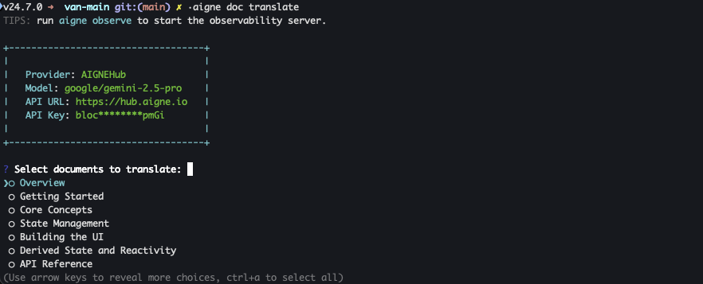

# 本地化文件

將您的文件提供多種語言版本對於觸及全球受眾至關重要。本指南提供逐步流程，說明如何使用 `aigne doc localize` 指令將您的內容本地化為 12 種支援的語言之一，確保全球各地的使用者都能輕鬆存取和理解您的文件。

## 翻譯流程概覽

翻譯文件的主要指令是 `aigne doc localize`。此指令可以兩種模式執行：互動式或非互動式（使用命令列旗標）。兩種方法都設計得簡單明瞭，讓您能有效率地管理單一或多語言的翻譯。

### 互動模式 (Beta)

若需引導式體驗，請在不帶任何引數的情況下執行此指令。對於剛接觸翻譯功能或偏好逐步流程的使用者，這是建議的方法。

```bash icon=lucide:terminal
aigne doc localize
```

當您執行此指令時，DocSmith 將啟動一個互動式會話：

1.  首先，系統會提示您從專案中所有可用的文件檔案清單中，選取您希望本地化的特定文件。
2.  接著，系統會要求您選擇目標語言。系統支援 12 種語言，您先前選擇過的任何語言都會被預先勾選，以簡化流程。



選取文件後，您將看到可供選擇的語言清單。


一旦您的選擇被確認，DocSmith 將開始將每份文件翻譯成您選擇的每一種語言。

### 命令列用法

若要實現自動化、腳本化或更直接的控制，您可以直接在命令列中提供引數。

```bash icon=lucide:terminal
aigne doc localize [options]
```

#### 選項

`localize` 指令接受以下選項來指定文件、語言和其他設定。

<x-field-group>
  <x-field data-name="--docs" data-type="array" data-required="false">
    <x-field-desc markdown>指定一或多個要翻譯的文件路徑。若省略此選項，工具將進入互動模式以供選擇文件。</x-field-desc>
  </x-field>
  <x-field data-name="--langs" data-type="array" data-required="false">
    <x-field-desc markdown>目標語言代碼清單（例如 `zh`、`ja`、`de`）。若未提供，系統將提示您以互動方式選擇語言。</x-field-desc>
  </x-field>
  <x-field data-name="--glossary" data-type="string" data-required="false">
    <x-field-desc markdown>詞彙表檔案的路徑（例如 `@/path/to/glossary.md`）。此檔案有助於在所有翻譯中為特定術語保持一致的用詞。</x-field-desc>
  </x-field>
  <x-field data-name="--feedback" data-type="string" data-required="false">
    <x-field-desc markdown>向 AI 提供具體指示以引導其翻譯風格（例如，「使用正式語氣並將技術術語保留為英文」）。此回饋也會記錄在文件的歷史記錄中，以供未來參考。</x-field-desc>
  </x-field>
  <x-field data-name="--diagram" data-type="boolean" data-required="false">
    <x-field-desc markdown>僅翻譯圖表圖片，而不翻譯文件內容。使用此選項可更新圖表中的文字標籤，同時保持文件主體不變。</x-field-desc>
  </x-field>
</x-field-group>

#### 範例

1.  **將特定文件翻譯成多種語言：**

    若要將 `overview.md` 和 `getting-started.md` 翻譯成中文和日文，請使用以下指令：
    ```bash icon=lucide:terminal
    aigne doc localize --docs overview.md --docs getting-started.md --langs zh ja
    ```

2.  **使用詞彙表和風格回饋進行翻譯：**

    若要將 `overview.md` 翻譯成德文，同時確保術語一致和語氣正式，您可以包含 `--glossary` 和 `--feedback` 選項：
    ```bash icon=lucide:terminal
    aigne doc localize --docs overview.md --langs de --feedback "Use a formal tone" --glossary @/path/to/glossary.md
    ```

## 支援的語言

DocSmith 為 12 種語言提供專業級的翻譯。使用 `--langs` 旗標時，請使用下表中的語言代碼。

| 語言 | 代碼 |
|---|---|
| English | `en` |
| 简体中文 | `zh` |
| 繁體中文 | `zh-TW` |
| 日本語 | `ja` |
| 한국어 | `ko` |
| Español | `es` |
| Français | `fr` |
| Deutsch | `de` |
| Português | `pt` |
| Русский | `ru` |
| Italiano | `it` |
| العربية | `ar` |

## 總結

本指南已涵蓋如何使用 `aigne doc localize` 指令，讓您的文件能被全球受眾存取。您可以使用互動模式以獲得引導式流程，或使用命令列選項以實現自動化和精確控制。

文件翻譯完成後，下一步就是發佈它們。有關此流程的詳細說明，請參閱[發佈文件](./guides-publishing-your-docs.md)指南。