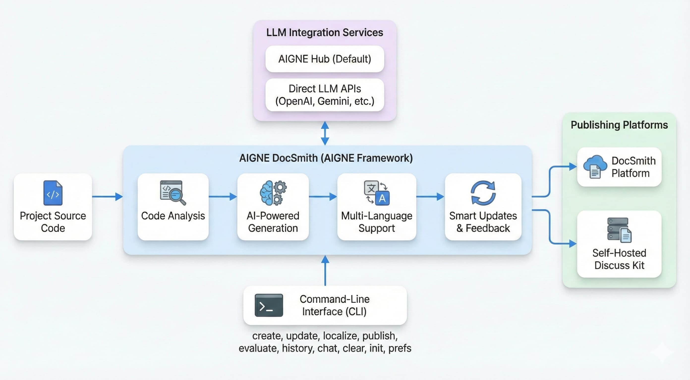
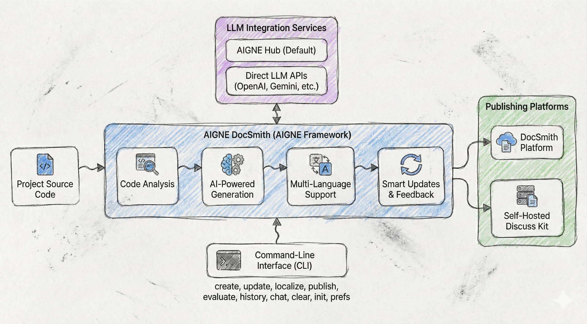
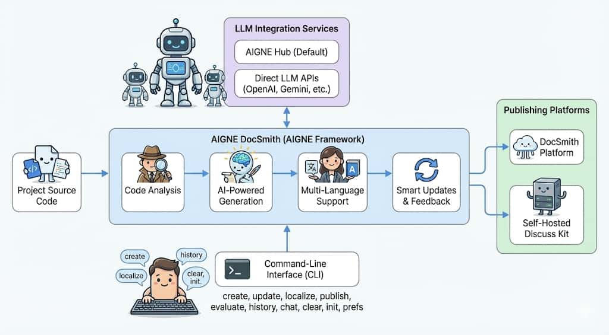
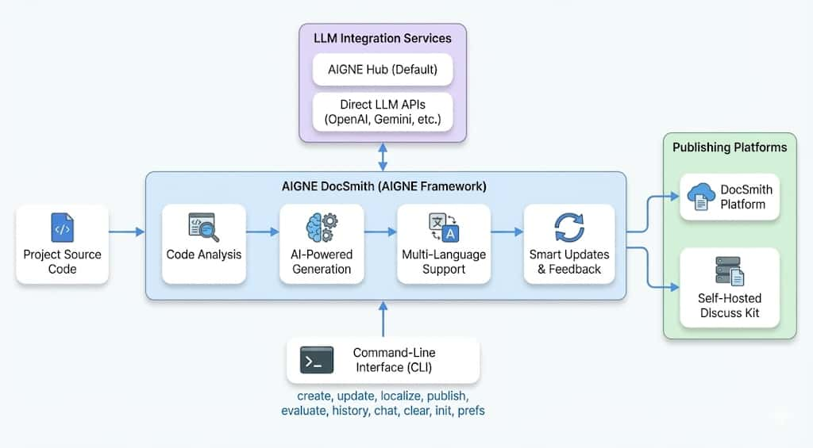
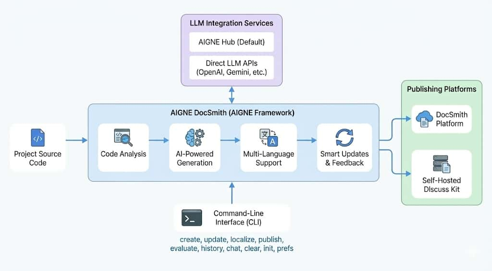
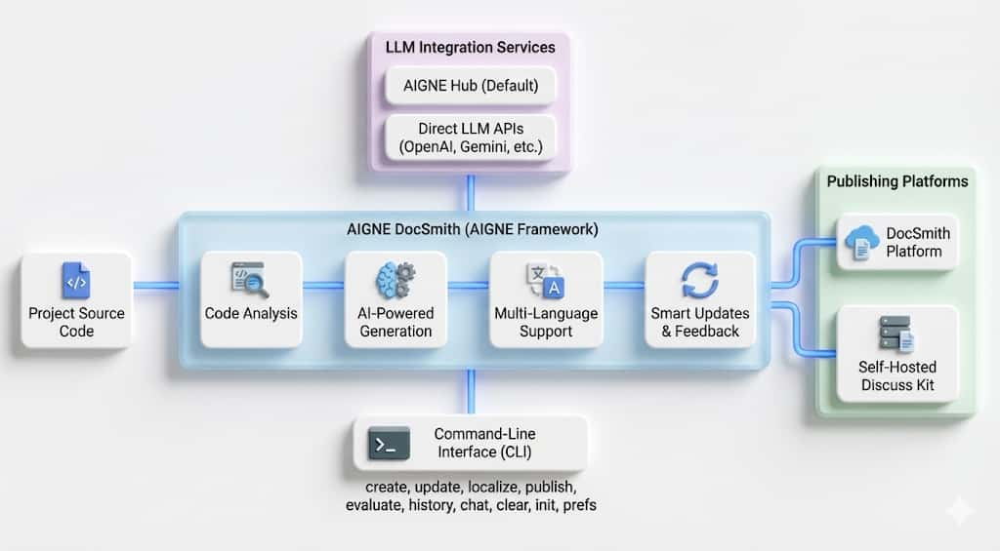

# 更新内容

本指南介绍如何使用 `update` 命令修改现有文档。您可以通过反馈更新文档内容、添加或更新图表以及移除图表。

## 基本用法

### 交互模式

不带任何参数运行该命令以进入交互模式：

```bash icon=lucide:terminal
aigne doc update
```

选择文档并提供反馈以进行更新。

### 命令行模式

使用命令行标志直接更新文档：

```bash icon=lucide:terminal
aigne doc update --docs /overview --feedback "Add a more detailed explanation of the core features."
```

## 更新图表

您可以通过提供反馈来更新文档中的图表。该工具支持更新现有图表或添加新图表。

### 更新特定图表

提供反馈以更新图表：

```bash icon=lucide:terminal
aigne doc update --docs /overview --feedback "Update the diagram to show the new architecture"
```

### 更新所有图表

使用 `--diagram` 标志来筛选和选择包含图表的文档：

```bash icon=lucide:terminal
aigne doc update --diagram
```

或者使用 `--diagram-all` 自动更新所有包含图表的文档：

```bash icon=lucide:terminal
aigne doc update --diagram-all
```

### 删除图表

通过提供反馈来移除图表：

```bash icon=lucide:terminal
aigne doc update --docs /overview --feedback "Remove the diagram"
```

## 图表样式

DocSmith 支持多种图表样式。您可以在反馈中指定样式或配置默认样式。支持的样式包括：

### 现代风格
简洁、专业的风格，具有现代设计元素。


### 标准流程图
采用传统符号的传统流程图样式。



### 手绘风格
素描般的风格，线条自然、有机。



### 拟人化风格
生动、拟人化的元素，具有类人特征。



### 扁平化设计
没有阴影或 3D 效果的扁平化设计。



### 极简风格
以最少的元素实现最高的清晰度。



### 3D 风格
具有深度和透视感的三维效果。



## 命令参数

| 参数 | 描述 | 是否必需 |
| :--- | :--- | :--- |
| `--docs` | 指定要更新的一个或多个文档的路径。可多次使用。 | 可选 |
| `--feedback` | 提供文本指令，说明要进行的更改。 | 可选 |
| `--reset` | 从头开始重新创建文档，忽略现有内容。 | 可选 |
| `--glossary` | 指定术语表文件的路径（`@/path/to/glossary.md`）。 | 可选 |
| `--diagram` | 筛选以仅显示包含图表的文档，并让用户选择要更新的文档。 | 可选 |
| `--diagram-all` | 自动选择所有包含图表的文档并进行更新，无需用户选择。 | 可选 |

---

有关添加或删除文档的信息，请参阅[添加文档](./guides-adding-a-document.md)和[删除文档](./guides-removing-a-document.md)指南。