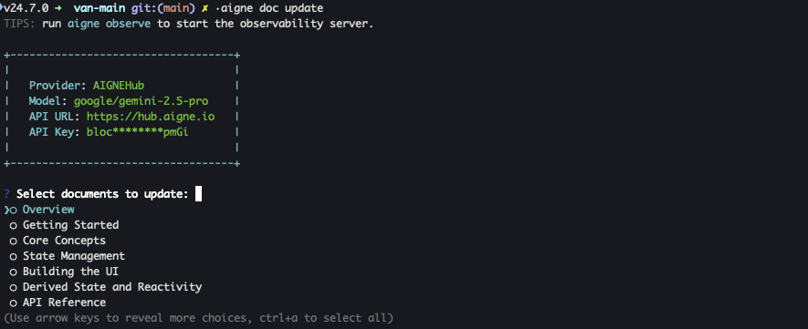

# Update Document

Need to make a quick change or overhaul a document? This guide explains how to use the `update` command to modify existing documents, whether you're incorporating new feedback, reflecting code changes, or starting from scratch. The tool provides both an interactive mode for guided changes and a direct mode for quick, command-line updates.

## Interactive Updates

For a guided experience, run the `update` command without any arguments. This launches an interactive session where you can select the documents you want to change and provide instructions.

1.  Start the interactive update process:
    ```bash aigne doc update icon=lucide:terminal
    aigne doc update
    ```
2.  You will see a list of your project's documents. Use the arrow keys to move, the spacebar to select one or more files, and `Enter` to confirm your selection.

    

The process that follows depends on whether you select a single document or multiple documents.

### Refining a Single Document

When you select one document, you enter an iterative refinement loop designed for making precise adjustments. You'll be presented with a set of choices:

*   **View document**: Displays the current version of the document's content directly in your terminal.
*   **Give feedback**: Prompts you to enter text describing the changes you want. For example, "Simplify the introduction for non-technical users" or "Add a code example for the authentication function."
*   **Done**: Exits the refinement loop and saves the latest version of the document.

After you submit feedback, the tool regenerates the document content. You can then view the new version and provide more feedback, repeating the cycle until you are satisfied with the result.

### Batch Updating Multiple Documents

If you select two or more documents, the tool performs a batch update. You will be prompted to provide a single instruction or piece of feedback. This feedback is then applied to all the selected documents simultaneously. This method is efficient for making consistent changes across your documentation, such as updating a recurring section or standardizing terminology.

## Direct Updates with Command-Line Flags

When you already know what changes are needed, you can use command-line flags to update documents directly, bypassing the interactive prompts.

### Applying Specific Feedback

To apply feedback to one or more documents, use the `--docs` and `--feedback` flags. The `--docs` flag specifies the file path, and `--feedback` provides the instructions for the update.

```bash Update a single document icon=lucide:terminal
aigne doc update --docs /overview --feedback "Add a more detailed explanation of the core features."
```

You can specify the `--docs` flag multiple times to apply the same feedback to several documents in one command.

```bash Update multiple documents icon=lucide:terminal
aigne doc update --docs /overview --docs /getting-started --feedback "Ensure the tone is consistent across both documents."
```

### Resetting a Document

To discard the current version of a document and regenerate it from the source code, use the `--reset` flag. This action tells the tool to ignore the existing content and create the document from scratch.

```bash Reset a document icon=lucide:terminal
aigne doc update --docs /overview --reset
```

This is particularly useful when a document is significantly out of date due to major changes in the project's codebase.

## Adding and Removing Documents

While the `update` command modifies existing content, you may also need to add new documents or remove ones that are no longer relevant. For these tasks, DocSmith provides dedicated commands:

*   **To add a new document**, see the [Add a Document](./guides-adding-a-document.md) guide.
*   **To remove an existing document**, refer to the [Remove a Document](./guides-removing-a-document.md) guide.
## Command Parameters

The `update` command accepts several parameters to control its behavior. Here is a summary of the available options:

| Parameter | Description | Required |
| :--- | :--- | :--- |
| `--docs` | Specifies the path(s) of the document(s) to update. Can be used multiple times. | Optional |
| `--feedback` | Provides textual instructions for the changes to be made to the specified document(s). | Optional |
| `--reset` | A boolean flag that, when present, recreate the document(s) from scratch, ignoring existing content. | Optional |
| `--glossary` | Specifies the path to a glossary file (`@/path/to/glossary.md`) to ensure consistent terminology. | Optional |

---

By using the `update`, `add-document`, and `remove-document` commands, you can manage the complete lifecycle of your documentation, keeping it aligned with your project's development. For information on creating documents for the first time, see the [Create Document](./guides-generating-documentation.md) guide.
