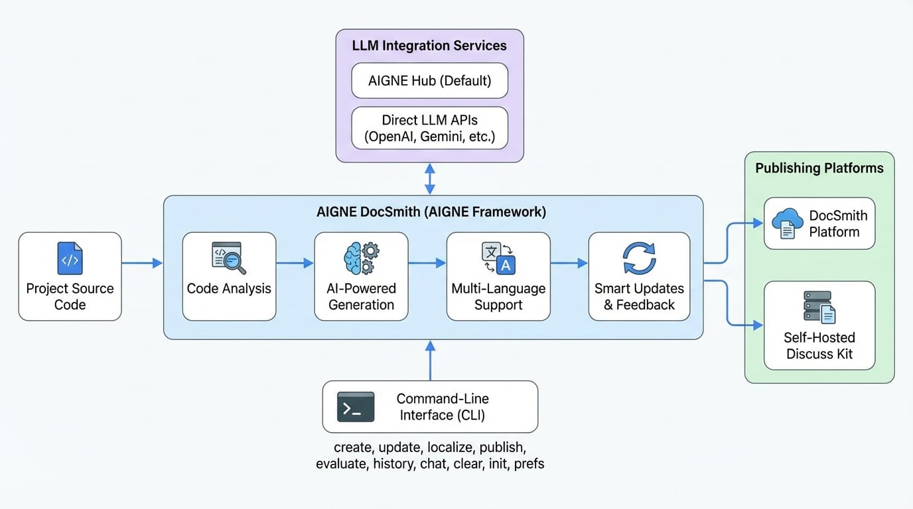

# 概要

絶えず変化するコードベースとドキュメントの同期を維持するのに苦労していませんか？AIGNE DocSmith はプロセス全体を自動化し、ソースコードを分析して正確で構造化された多言語ドキュメントを生成するため、あなたは優れたソフトウェアの構築に集中できます。

AIGNE DocSmith は、プロジェクトのソースコードからドキュメントを自動的に作成する AI 駆動のツールです。これは [AIGNE Framework](https://www.aigne.io/en/framework) 上に構築されており、コードベースを正確に反映した構造化された多言語ドキュメントを生成するように設計されています。

このツールは、手動でのドキュメント作成に共通する課題、例えば作成に時間がかかる、コードの進化とともにすぐに古くなる、セクション間で一貫性がないといった問題に対処します。このプロセスを自動化することで、DocSmith はドキュメントを常に最新、正確、かつ有用な状態に保つのに役立ちます。

## 仕組み

DocSmith は、プロジェクトのソースコードを分析して、その構造、コンポーネント、および機能を理解することによって動作します。この分析に基づいて、高レベルのガイドから詳細な API リファレンスまで、完全なドキュメントセットを生成します。

<!-- DIAGRAM_IMAGE_START:architecture:16:9 -->

<!-- DIAGRAM_IMAGE_END -->

## 主な機能

DocSmith は、作成から公開までのドキュメントライフサイクルを管理するための一連の機能を提供します。

*   **AI による生成**: コードベースを分析して論理的なドキュメント構造を提案し、コードの機能を説明するコンテンツを生成します。
*   **多言語サポート**: 英語、中国語（簡体字）、日本語を含む12言語にドキュメントを翻訳します。翻訳プロセスは文脈を認識し、技術的な正確性を維持します。
*   **LLM との統合**: 様々な大規模言語モデル（LLM）と接続します。デフォルトでは [AIGNE Hub](https://www.aigne.io/en/hub) を使用します。これは、個別の API キーを必要とせずに Google Gemini や OpenAI GPT などのモデルを切り替えることができるサービスです。プロバイダーに直接アクセスするために独自の API キーを設定することもできます。
*   **スマートアップデート**: ソースコードの変更を検出し、ドキュメントの対応するセクションを更新します。生成されたコンテンツを洗練させるために、具体的なフィードバックを提供することもできます。
*   **公開オプション**: 単一のコマンドで生成されたドキュメントを公開します。公式の DocSmith プラットフォームにデプロイするか、独自の [Discuss Kit](https://www.web3kit.rocks/discuss-kit) インスタンスを実行できます。Discuss Kit は、ドキュメントをホスティングおよび表示するためのサービスです。

## 利用可能なコマンド

DocSmith はコマンドラインインターフェースを通じて操作します。以下の表は、主要なコマンドとその機能の概要です。

| コマンド | 説明 |
| :--- | :--- |
| `generate` | ソースファイルから新しいドキュメントセットを作成します。 |
| `update` | コードの変更や新しいフィードバックに基づいて既存のドキュメントを修正します。 |
| `translate` | ドキュメントを12のサポートされている言語のいずれかまたは複数に翻訳します。 |
| `publish` | ドキュメントをライブでアクセス可能な URL にデプロイします。 |
| `evaluate` | 生成されたドキュメントの品質と完全性を評価します。 |
| `history` | ドキュメントに加えられた更新の履歴を表示します。 |
| `chat` | ドキュメントを生成・管理するためのインタラクティブモードを開始します。 |
| `clear` | 生成されたファイル、設定、およびキャッシュデータを削除します。 |
| `init` | 対話形式のプロセスを通じて、初期設定ファイルを作成するのをガイドします。 |
| `prefs` | ドキュメント生成のために保存された設定や構成を管理します。 |

---

この概要は、AIGNE DocSmith の目的と機能の要約を提供します。ツールの使用を開始するには、インストールとセットアップの手順について[入門ガイド](./getting-started.md)に進んでください。