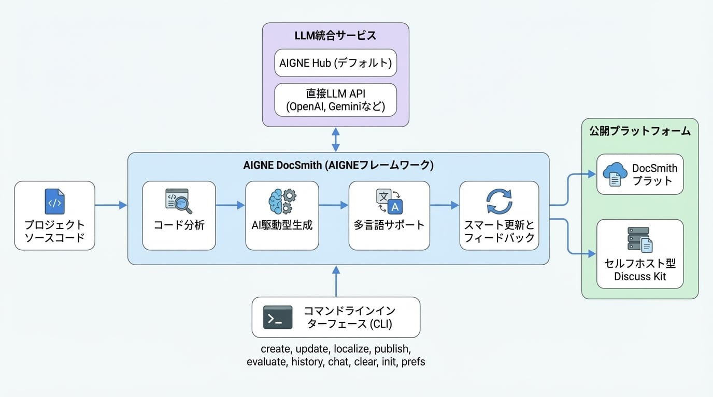

# 概要

AIGNE DocSmith は、AI を使用してプロジェクトのソースコードを分析し、ドキュメントを自動的に生成するドキュメンテーションツールです。[AIGNE Framework](https://www.aigne.io/en/framework) 上に構築されており、コードベースと同期した構造化された多言語ドキュメントを生成します。このプロセスは、時間がかかり、古くなりやすく、一貫性がなくなりがちな手動でのドキュメント作成の課題に対処します。

## 仕組み

<!-- DIAGRAM_IMAGE_START:architecture:16:9::1765020134 -->

<!-- DIAGRAM_IMAGE_END -->

DocSmith は、プロジェクトのソースコードを分析してその構造と機能を理解することで機能します。この分析から、高レベルのガイドや詳細な API リファレンスを含む完全なドキュメントセットを生成します。

## 主な機能

DocSmith は、作成から公開までのドキュメントライフサイクルを処理するための一連の機能を提供します。

- **AI による生成**: コードベースを分析して、コードの機能を説明する論理的なドキュメント構造とコンテンツを生成します。
- **多言語サポート**: 文脈を認識した翻訳を使用して、技術的な正確性を維持しながら、英語、中国語（簡体字）、日本語など 12 の言語にドキュメントを翻訳します。
- **LLM 統合**: 複数の大規模言語モデル（LLM）と接続します。デフォルトでは、個別の API キーなしで Google Gemini や OpenAI GPT などのモデルを切り替えるためのサービスである [AIGNE Hub](https://www.aigne.io/en/hub) を使用します。また、プロバイダーに直接アクセスするために独自のキーを設定することもできます。
- **スマートアップデート**: ソースコードの変更を検出し、対応するドキュメントセクションを更新します。生成されたコンテンツを改善するためのフィードバックを提供できます。
- **公開オプション**: 単一のコマンドでドキュメントをデプロイします。公式の DocSmith プラットフォーム、またはドキュメントをホスティングおよび表示するためのサービスである [Discuss Kit](https://www.web3kit.rocks/discuss-kit) のセルフホストインスタンスに公開できます。

## 利用可能なコマンド

DocSmith はコマンドラインインターフェースを通じて操作します。以下の表は、主要なコマンドとその機能の概要です。

| コマンド | 説明 |
| :--- | :--- |
| `init` | 対話的なプロセスを通じて、初期設定ファイルを作成します。 |
| `create` | ソースファイルから新しいドキュメントセットを作成します。 |
| `add-document` | 既存の構造に新しいドキュメントを追加します。 |
| `remove-document` | 既存の構造からドキュメントを削除します。 |
| `update` | コードの変更や新しいフィードバックに基づいて既存のドキュメントを修正します。 |
| `localize` | サポートされている 12 言語のいずれかまたは複数にドキュメントを翻訳します。 |
| `publish` | ドキュメントをライブのアクセス可能な URL にデプロイします。 |
| `evaluate` | 作成されたドキュメントの品質と完全性を評価します。 |
| `history` | ドキュメントに行われた更新の履歴を表示します。 |
| `chat` | 対話モードセッションを開始してドキュメントを生成および管理します。 |
| `prefs` | ドキュメント作成のために保存された設定や構成を管理します。 |
| `clear` | 作成されたファイル、構成、およびキャッシュされたデータを削除します。 |

---

この概要では、AIGNE DocSmith の目的と機能の概要を説明しました。ツールの使用を開始するには、[はじめに](./getting-started.md) ガイドに進み、インストールとセットアップの手順を確認してください。