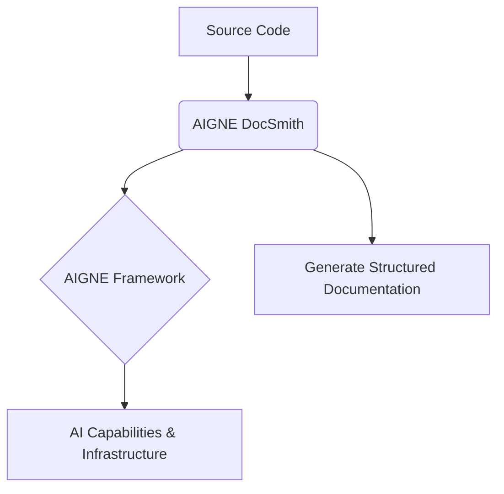

# Overview

AIGNE DocSmith is an AI-driven documentation generation tool built on the [AIGNE framework](https://www.aigne.io/en/framework). It automatically creates well-structured, comprehensive, and multilingual professional documentation directly from your source code, aiming to significantly simplify the process of writing and maintaining technical documents.

## DocSmith's Position in the AIGNE Ecosystem

DocSmith is part of the [AIGNE](https://www.aigne.io) ecosystem, a comprehensive AI application development platform. It integrates seamlessly with other AIGNE components, fully leveraging the platform's powerful AI capabilities and infrastructure.

The following diagram illustrates DocSmith's central role in the overall workflow:

## Key Features

DocSmith offers a range of features designed to fully automate the documentation creation and maintenance process.

| Feature | Description |
| --- | --- |
| **Automatic Structure Planning** | Intelligently analyzes your codebase to generate a comprehensive and logically clear document structure. |
| **AI Content Generation** | Automatically populates detailed, high-quality documentation content based on the planned structure. |
| **Multilingual Support** | Seamlessly translates your documentation into more than 12 languages, including Chinese, English, and Japanese. |
| **AIGNE Hub Integration** | Use AIGNE Hub as an LLM provider without needing your own API key, and easily switch between different large language models. |
| **Discuss Kit Publishing** | Supports publishing documentation to the official platform or your self-deployed Discuss Kit instance. |
| **Documentation Update Mechanism** | Automatically detects changes in the source code and updates the documentation content accordingly. |
| **Single Document Optimization** | Allows for the regeneration and optimization of content for specific documents by providing feedback. |

## Next Steps

Through this section, you've gained a basic understanding of AIGNE DocSmith's core concepts and features. Now you're ready to get started.

Please continue to the [Quick Start](./getting-started.md) guide, which will walk you through the installation process and help you generate your first document in minutes.