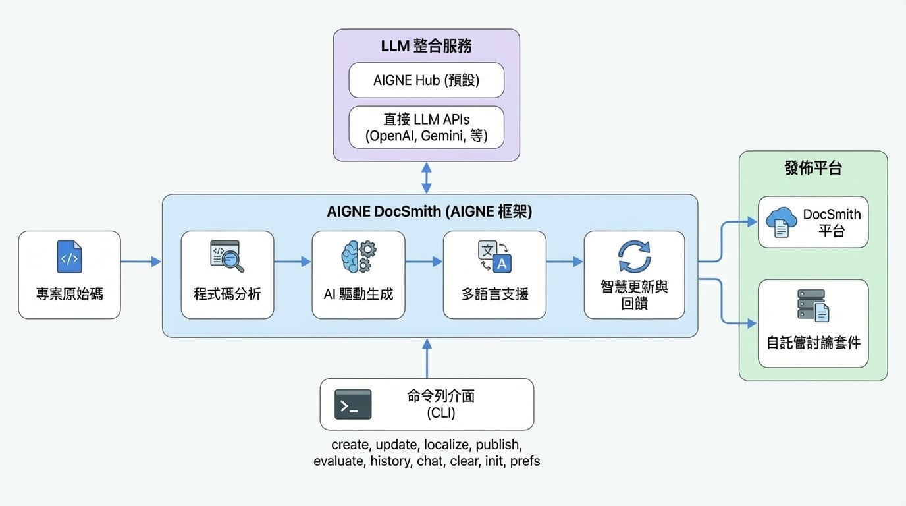

# 總覽

AIGNE DocSmith 是一套文件工具，它利用 AI 分析您的專案原始碼並自動產生文件。它基於 [AIGNE Framework](https://www.aigne.io/en/framework) 建構，可產生與您的程式碼庫同步的結構化、多語言文件。此過程解決了手動編寫文件所面臨的挑戰，例如耗時、容易過時以及內容不一致。

## 運作方式

<!-- DIAGRAM_IMAGE_START:architecture:16:9:1765020134 -->

<!-- DIAGRAM_IMAGE_END -->

DocSmith 透過分析您專案的原始碼來理解其結構和功能。基於此分析，它會產生一套完整的文件，包括高階指南和詳細的 API 參考。

## 核心功能

DocSmith 提供一系列功能來處理從建立到發布的整個文件生命週期。

- **AI 驅動產生**：分析程式碼庫，以產生能解釋程式碼功能的邏輯性文件結構與內容。
- **多語言支援**：將文件翻譯成 12 種語言，例如英文、簡體中文和日文，並使用具備情境感知能力的翻譯以維持技術準確性。
- **LLM 整合**：可連接多個大型語言模型 (LLM)。預設使用 [AIGNE Hub](https://www.aigne.io/en/hub)，這是一項無需獨立 API 金鑰即可在 Google Gemini 和 OpenAI GPT 等模型之間切換的服務。您也可以設定自己的金鑰以直接存取供應商。
- **智慧更新**：偵測原始碼變更並更新對應的文件章節。您可以提供回饋意見以優化產生的內容。
- **發布選項**：透過單一指令部署文件。您可以將文件發布到官方 DocSmith 平台，或是一個自行託管的 [Discuss Kit](https://www.web3kit.rocks/discuss-kit) 實例，這是一項用於託管和顯示文件的服務。

## 可用指令

DocSmith 透過命令列介面操作。下表總結了主要指令及其功能。

| 指令 | 說明 |
| :--- | :--- |
| `init` | 引導您完成互動式流程，以建立初始設定檔。 |
| `create` | 從您的原始檔建立一套新文件。 |
| `add-document` | 將一份新文件新增至現有結構中。 |
| `remove-document` | 從現有結構中移除一份文件。 |
| `update` | 根據程式碼變更或新的回饋意見修改現有文件。 |
| `localize` | 將文件翻譯成 12 種支援語言中的一種或多種。 |
| `publish` | 將您的文件部署到一個可公開存取的有效 URL。 |
| `evaluate` | 評估您所建立文件的品質與完整性。 |
| `history` | 檢視您文件的更新歷史記錄。 |
| `chat` | 啟動互動模式工作階段以產生和管理文件。 |
| `prefs` | 管理用於文件建立的已儲存偏好設定與組態。 |
| `clear` | 移除已建立的檔案、設定和快取資料。 |

---

本總覽提供了 AIGNE DocSmith 的用途和功能摘要。若要開始使用此工具，請前往 [入門指南](./getting-started.md) 以取得安裝和設定說明。