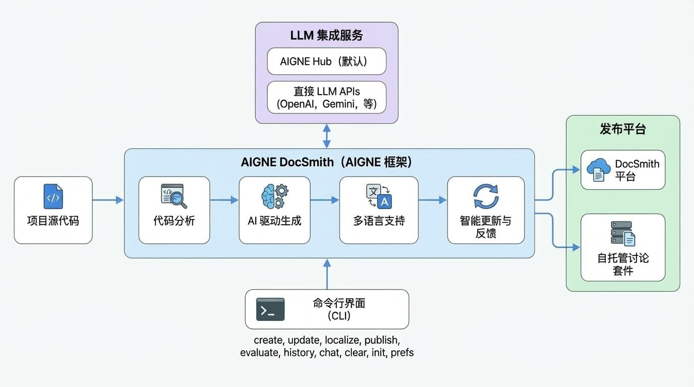

# 概述

AIGNE DocSmith 是一款文档工具，它利用 AI 分析您项目的源代码并自动生成文档。它构建于 [AIGNE Framework](https://www.aigne.io/en/framework) 之上，能够生成与您的代码库同步的结构化、多语言文档。这一过程解决了手动编写文档所面临的挑战，如耗时、易过时和不一致等问题。

## 工作原理

<!-- DIAGRAM_IMAGE_START:architecture:16:9::1765020134 -->

<!-- DIAGRAM_IMAGE_END -->

DocSmith 通过分析您项目的源代码来理解其结构和功能。基于此分析，它会生成一套完整的文档，包括高级指南和详细的 API 参考。

## 核心功能

DocSmith 提供了一系列功能来处理从创建到发布的整个文档生命周期。

- **AI 驱动生成**：分析代码库以生成逻辑清晰的文档结构和解释代码功能的内容。
- **多语言支持**：将文档翻译成 12 种语言，如英语、简体中文和日语，并使用具备上下文感知能力的翻译来保持技术准确性。
- **LLM 集成**：连接多个大语言模型（LLMs）。它默认使用 [AIGNE Hub](https://www.aigne.io/en/hub)，该服务支持在 Google Gemini 和 OpenAI GPT 等模型之间切换，无需单独的 API 密钥。您也可以配置自己的密钥以直接访问提供商。
- **智能更新**：检测源代码变更并更新相应的文档章节。您可以提供反馈来优化生成的内容。
- **发布选项**：通过单个命令部署文档。您可以发布到官方 DocSmith 平台，或自托管的 [Discuss Kit](https://www.web3kit.rocks/discuss-kit) 实例，该服务用于托管和展示文档。

## 可用命令

DocSmith 通过命令行界面进行操作。下表总结了主要命令及其功能。

| 命令 | 描述 |
| :--- | :--- |
| `init` | 通过交互式流程引导您创建一个初始配置文件。 |
| `create` | 根据您的源文件创建一套新文档。 |
| `add-document` | 向现有结构中添加一篇新文档。 |
| `remove-document` | 从现有结构中移除一篇文档。 |
| `update` | 根据代码变更或新的反馈修改现有文档。 |
| `localize` | 将文档翻译成 12 种支持的语言中的一种或多种。 |
| `publish` | 将您的文档部署到一个可在线访问的 URL。 |
| `evaluate` | 评估您所创建文档的质量和完整性。 |
| `history` | 查看对您的文档所做的更新历史。 |
| `chat` | 启动交互模式会话以生成和管理文档。 |
| `prefs` | 管理用于文档创建的已保存偏好和配置。 |
| `clear` | 移除已创建的文件、配置和缓存数据。 |

---

本概述总结了 AIGNE DocSmith 的用途和功能。要开始使用该工具，请继续阅读[入门指南](./getting-started.md)以获取安装和设置说明。