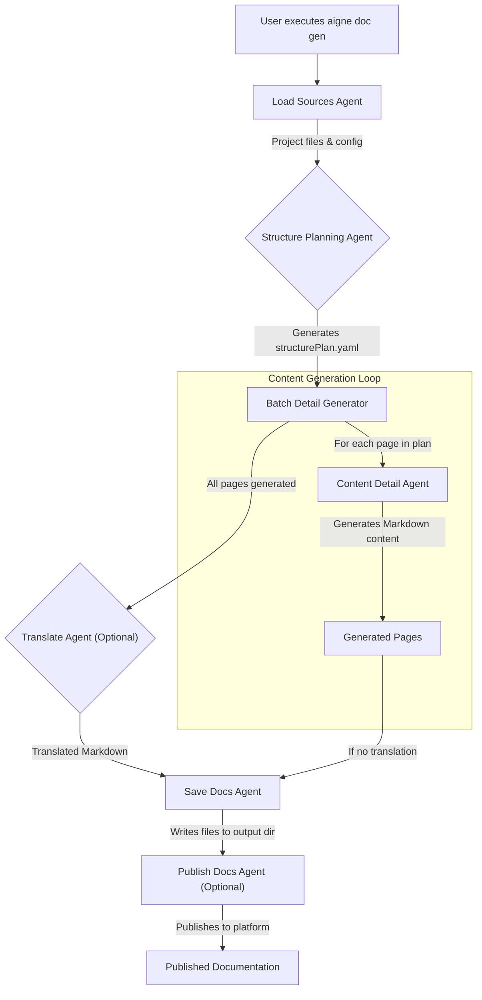

# How It Works

AIGNE DocSmith operates on a sophisticated, agent-based architecture. Instead of a single monolithic program, it uses a collection of specialized AI agents that collaborate in a pipeline to analyze your project, structure the content, generate detailed documentation, and publish the results. This modular approach allows for flexibility and extensibility.

This document provides a high-level architectural overview of this documentation generation pipeline.

## Architectural Overview

The core of DocSmith is a pipeline of agents orchestrated by the main AIGNE engine. When you run a command like `aigne doc gen`, the engine invokes a series of agents in a specific order. Each agent performs a distinct task, passing its output to the next agent in the chain.

The following diagram illustrates the typical workflow for generating documentation:

## The Core Agents

While many specialized agents are involved, the process relies on a few core agents that handle the primary stages of documentation creation. Each is designed for a specific purpose, ensuring high-quality output at every step.

| Agent Name | Role in the Pipeline |
| --- | --- |
| `load-sources` | The first step in the chain. This agent scans your project directory, reads configuration files, and gathers all necessary context. |
| `structure-planning` | Analyzes the loaded sources to create a logical hierarchy for the documentation. It outputs the `structurePlan`, the blueprint for the entire docset. |
| `content-detail-generator` | Takes an individual item from the `structurePlan` and generates its detailed Markdown content based on the source data and rules. |
| `batch-docs-detail-generator` | Orchestrates the `content-detail-generator`, running it for every page defined in the `structurePlan` to build the complete set of documents. |
| `translate` | If configured, this agent takes the generated content and translates it into the specified target languages. |
| `publish-docs` | Handles the final step of making your documentation public, interfacing with publishing platforms or deployment scripts. |

## The Process in Action

When you initiate a generation command, the AIGNE engine starts the pipeline:

1.  **Loading:** The `load-sources` agent gathers all relevant information.
2.  **Planning:** The `structure-planning` agent designs the documentation's table of contents.
3.  **Generating:** The `batch-docs-detail-generator` iterates through the plan, calling the `content-detail-generator` for each section to write the actual content.
4.  **Finalizing:** The content is then passed through optional steps like translation before being saved to your local filesystem by the `save-docs` agent.
5.  **Publishing:** If you use the publish command, the `publish-docs` agent takes the final output and deploys it.

This agent-based system means you can customize the pipeline or even swap out agents to fit unique workflows. For more information on how you can contribute to this ecosystem, see our [Contributing Guide](./advanced-contributing.md).