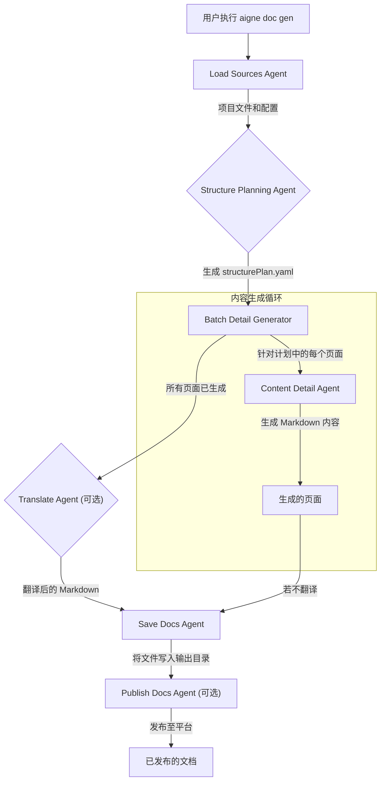

# 工作原理

AIGNE DocSmith 基于一个复杂的、基于 Agent 的架构运行。它并非单一的整体程序，而是使用一组专业的 AI Agent，这些 Agent 在一个管道中协同工作，以分析您的项目、构建内容结构、生成详细文档并发布结果。这种模块化的方法实现了灵活性和可扩展性。

本文档将对该文档生成管道进行高层级的架构概述。

## 架构概述

DocSmith 的核心是由主 AIGNE 引擎编排的 Agent 管道。当您运行像 `aigne doc gen` 这样的命令时，引擎会按特定顺序调用一系列 Agent。每个 Agent 执行一项独特的任务，并将其输出传递给链中的下一个 Agent。

下图说明了生成文档的典型工作流程：

## 核心 Agent

尽管涉及许多专业的 Agent，但该过程依赖于少数几个核心 Agent 来处理文档创建的主要阶段。每个 Agent 都为特定目的而设计，以确保每一步都能产出高质量的输出。

| Agent 名称 | 在管道中的角色 |
| --- | --- |
| `load-sources` | 链中的第一步。此 Agent 扫描您的项目目录，读取配置文件，并收集所有必要的上下文。 |
| `structure-planning` | 分析已加载的源文件，为文档创建逻辑层次结构。它输出 `structurePlan`，即整个文档集的蓝图。 |
| `content-detail-generator` | 从 `structurePlan` 中获取单个项目，并根据源数据和规则生成其详细的 Markdown 内容。 |
| `batch-docs-detail-generator` | 编排 `content-detail-generator`，为 `structurePlan` 中定义的每个页面运行它，以构建完整的文档集。 |
| `translate` | 如果配置了此 Agent，它会获取生成的内容并将其翻译成指定的目标语言。 |
| `publish-docs` | 处理将文档公开的最后一步，与发布平台或部署脚本对接。 |

## 流程详解

当您启动生成命令时，AIGNE 引擎会启动该管道：

1.  **加载：** `load-sources` Agent 收集所有相关信息。
2.  **规划：** `structure-planning` Agent 设计文档的目录。
3.  **生成：** `batch-docs-detail-generator` 遍历规划，为每个部分调用 `content-detail-generator` 来编写实际内容。
4.  **最终处理：** 然后，内容会经过翻译等可选步骤，最后由 `save-docs` Agent 保存到您的本地文件系统。
5.  **发布：** 如果您使用发布命令，`publish-docs` Agent 会获取最终输出并进行部署。

这个基于 Agent 的系统意味着您可以自定义管道，甚至可以更换 Agent 以适应独特的工作流程。有关如何为该生态系统做出贡献的更多信息，请参阅我们的[贡献指南](./advanced-contributing.md)。