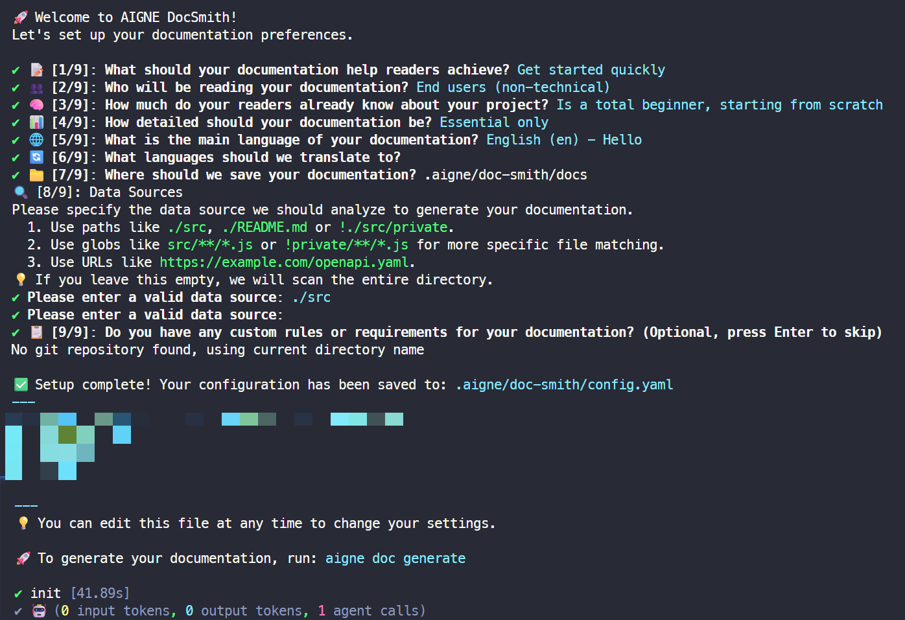

# Initial Setup

This guide provides a step-by-step walkthrough of the interactive setup process for AIGNE DocSmith. This procedure runs automatically the first time you execute `aigne doc generate`, but you can also start it manually. The goal is to create a `config.yaml` file, which stores your preferences for generating documentation.

## How to Start the Setup Process

To begin the configuration manually, navigate to your project's root directory in a terminal and run the following command:

```sh aigne doc init icon=lucide:terminal
aigne doc init
```

This command starts a 9-step interactive questionnaire to configure your documentation settings.

## Configuration Steps

The setup process will prompt you with a series of questions. The following sections detail each step.

### Step 1: Define Documentation Purpose

The first step is to establish the primary goals for your documentation. This selection influences the tone, structure, and focus of the generated content.

**Prompt:** `📝 [1/9]: What should your documentation help readers achieve?`

You can select one or more options from the following list:

| Option             | Name                      | Description                                                  |
| :----------------- | :------------------------ | :----------------------------------------------------------- |
| `getStarted`       | Get started quickly       | Help new users go from zero to working in under 30 minutes.  |
| `completeTasks`    | Complete specific tasks   | Guide users through common workflows and use cases.          |
| `findAnswers`      | Find answers fast         | Provide a searchable reference for all features and APIs.    |
| `understandSystem` | Understand the system     | Explain how it works and the reasoning behind design decisions. |
| `solveProblems`    | Solve problems            | Help users troubleshoot and fix issues.                      |
| `mixedPurpose`     | Mix of above              | Cover multiple needs comprehensively.                        |

### Step 2: Identify Target Audience

Next, specify the primary readers of your documentation. This helps to adjust the language and technical depth to an appropriate level.

**Prompt:** `👥 [2/9]: Who will be reading your documentation?`

You may select multiple audiences from this list:

| Option           | Name                       | Description                                                  |
| :--------------- | :------------------------- | :----------------------------------------------------------- |
| `endUsers`       | End users (non-technical)  | People who use the product but do not write code.            |
| `developers`     | Developers integrating     | Engineers adding the product to their projects.              |
| `devops`         | DevOps/Infrastructure      | Teams deploying, monitoring, and maintaining systems.        |
| `decisionMakers` | Technical decision makers  | Architects or leads evaluating the technology for implementation. |
| `supportTeams`   | Support teams              | People helping others use the product.                       |
| `mixedTechnical` | Mixed technical audience   | A combination of developers, DevOps, and other technical users. |

### Step 3: Specify Reader Knowledge Level

Indicate the assumed knowledge level of your audience. This ensures the content is presented effectively, avoiding information that is either too basic or too complex.

**Prompt:** `🧠 [3/9]: How much do your readers already know about your project?`

Select the option that best describes your readers:

| Option                     | Name                         | Description                                                        |
| :------------------------- | :--------------------------- | :----------------------------------------------------------------- |
| `completeBeginners`        | Complete beginners           | New to the domain or technology entirely.                          |
| `domainFamiliar`           | Domain-familiar, tool-new    | Know the problem space but are new to this specific solution.      |
| `experiencedUsers`         | Experienced users            | Regular users who need reference material or advanced topics.      |
| `emergencyTroubleshooting` | Emergency/troubleshooting    | Users who have encountered a problem and need to fix it quickly.   |
| `exploringEvaluating`      | Exploring/evaluating         | Users trying to determine if the tool fits their needs.            |

### Step 4: Set Documentation Depth

Choose how detailed the documentation should be. This parameter determines the scope and level of detail in the generated content.

**Prompt:** `📊 [4/9]: How detailed should your documentation be?`

Select one of the following levels:

| Option             | Name                 | Description                                                          |
| :----------------- | :------------------- | :------------------------------------------------------------------- |
| `essentialOnly`    | Essential only       | Covers the most common 80% of use cases concisely.                   |
| `balancedCoverage` | Balanced coverage    | Provides good depth with practical examples.                         |
| `comprehensive`    | Comprehensive        | Covers all features, edge cases, and advanced scenarios.            |
| `aiDecide`         | Let AI decide        | The tool analyzes code complexity to suggest an appropriate depth.   |

### Step 5: Select Primary Language

Choose the main language for your documentation. The system will detect your operating system's language and suggest it as the default.

**Prompt:** `🌐 [5/9]: What is the main language of your documentation?`

You can select from a list of 12 supported languages, including English, Chinese (Simplified), and Spanish.

### Step 6: Choose Translation Languages

Select any additional languages into which you want the documentation to be translated.

**Prompt:** `🔄 [6/9]: What languages should we translate to?`

You can choose multiple languages from the supported options, excluding the primary language selected in the previous step.

### Step 7: Define Documentation Directory

Specify the folder where the generated documentation files will be saved.

**Prompt:** `📁 [7/9]: Where should we save your documentation?`

The default path is `.aigne/doc-smith/docs`. You can accept this default or provide a different path.

### Step 8: Specify Content Sources

Indicate which files, folders, or URLs the tool should analyze to generate documentation. You can add multiple paths and use glob patterns for more specific file matching.

**Prompt:** `🔍 [8/9]: Data Sources`

You will be prompted to enter file paths (e.g., `./src`), glob patterns (e.g., `src/**/*.js`), or URLs (e.g., `https://example.com/openapi.yaml`). If no paths are provided, the tool will analyze the entire project directory by default.

### Step 9: Provide Custom Rules

This optional step allows you to provide specific instructions or constraints for the AI to follow during content generation.

**Prompt:** `📋 [9/9]: Do you have any custom rules or requirements for your documentation? (Optional, press Enter to skip)`

You can input any requirements, such as tone, style, or content to exclude. For example: "Focus on technical accuracy and avoid marketing terminology."

## The `config.yaml` File

After you answer all the questions, DocSmith saves your responses to a configuration file named `config.yaml`, located in the `.aigne/doc-smith/` directory of your project. This file acts as the blueprint for all future documentation generation and can be manually edited at any time.

Below is an example of a generated `config.yaml` file:

```yaml config.yaml icon=logos:yaml
# Project information for documentation publishing
projectName: AIGNE DocSmith
projectDesc: AIGNE DocSmith is a powerful, AI-driven documentation generation tool...
projectLogo: https://docsmith.aigne.io/image-bin/uploads/9645caf64b4232699982c4d940b03b90.svg

# AI Thinking Configuration
thinking:
  effort: standard

# =============================================================================
# Documentation Configuration
# =============================================================================

# Purpose: What's the main outcome you want readers to achieve?
documentPurpose:
  - getStarted
  - completeTasks

# Target Audience: Who will be reading this most often?
targetAudienceTypes:
  - endUsers

# Reader Knowledge Level: What do readers typically know when they arrive?
readerKnowledgeLevel: completeBeginners

# Documentation Depth: How comprehensive should the documentation be?
documentationDepth: comprehensive

# Custom Rules: Define specific documentation generation rules and requirements
rules: |
  Avoid using vague or empty words that don't provide measurable or specific details...

# Target Audience: Describe your specific target audience and their characteristics
targetAudience: |
  
# Language settings
locale: en
translateLanguages:
  - zh
  - zh-TW
  - ja

# Paths
docsDir: ./docs  # The directory where the generated documentation will be saved.
sourcesPath:  # The source code paths to analyze.
  - ./README.md
  - ./agents

# Image filtering settings
media:
  minImageWidth: 800
```

## Summary and Next Steps

Once the setup is complete, you will see a confirmation message displaying the path to your new configuration file.



With your initial configuration saved, you are now prepared to create your documentation.

<x-cards data-columns="2">
  <x-card data-title="Generating Documentation" data-href="/guides/generating-documentation" data-icon="lucide:file-text">
    Learn how to run the generation process to create your first set of documents.
  </x-card>
  <x-card data-title="Managing Preferences" data-href="/configuration/managing-preferences" data-icon="lucide:settings">
    Find out how to view and modify your saved configuration at any time.
  </x-card>
</x-cards>