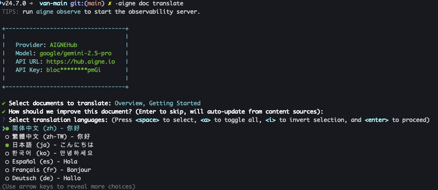

# 语言支持

AIGNE DocSmith 提供 12 种语言的自动化文档翻译，使您能够为全球受众生成和维护本地化内容。该功能主要通过 `aigne doc translate` 命令进行管理。

翻译工作流使用 AI 引擎处理您的源文档，并生成您所选目标语言的版本。`aigne doc translate` 命令提供了一个交互式界面，引导您选择要翻译的文档和语言。


## 支持的语言

DocSmith 支持以下语言的 AI 翻译。您可以在使用 `aigne doc init` 进行初始设置时定义项目的主要语言，并可以选择以下任意数量的语言进行翻译。

| 语言 | 语言代码 |
|---|---|
| English | `en` |
| 简体中文 | `zh` |
| 繁體中文 | `zh-TW` |
| 日本語 | `ja` |
| 한국어 | `ko` |
| Español | `es` |
| Français | `fr` |
| Deutsch | `de` |
| Português | `pt` |
| Русский | `ru` |
| Italiano | `it` |
| العربية | `ar` |

## 如何配置和使用翻译

语言设置在您初始化项目时进行配置。您可以随时使用 `aigne doc translate` 命令添加新语言或翻译现有文档，该命令支持两种操作模式。

### 用于引导式翻译的交互模式

如需分步引导流程，请运行不带任何参数的命令。建议大多数用户使用此方法。

```bash 交互式翻译 icon=lucide:wand
aigne doc translate
```

交互模式会显示一系列提示，允许您选择要翻译的文档并从列表中选择目标语言。如果项目中尚未包含某些翻译语言，此模式也允许您将其添加到项目配置中。



### 用于自动化的命令行参数

为了直接控制或在自动化脚本中使用，您可以将文档和语言指定为命令行参数。此方法适用于集成到 CI/CD 管道中。

```bash 命令示例 icon=lucide:terminal
# 将 overview.md 和 examples.md 翻译成中文和日文
aigne doc translate --langs zh --langs ja --docs overview.md --docs examples.md
```

下表详细介绍了 `translate` 命令的关键参数：

| 参数 | 描述 |
|---|---|
| `--langs` | 指定目标语言代码。该标志可以多次使用以选择多种语言。 |
| `--docs` | 指定要翻译的文档路径（例如 `overview.md`）。该标志也可以多次使用。 |
| `--feedback` | 提供具体指令以指导翻译模型（例如 `"使用正式语气"`）。 |
| `--glossary` | 使用自定义术语表文件（例如 `@path/to/glossary.md`）来确保项目特定术语的翻译一致性。 |

---

本节概述了可用的语言以及如何启用它们。有关翻译工作流的完整指南，请参阅 [翻译文档](./features-translate-documentation.md) 指南。