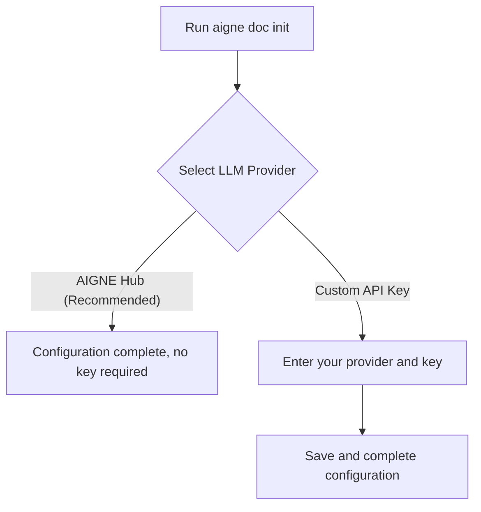

# AI Model Providers

AIGNE DocSmith utilizes Large Language Models (LLMs) to generate and optimize document content. To provide flexibility, DocSmith supports multiple LLM providers, allowing you to choose the most suitable model service for your needs.

## AIGNE Hub (Recommended)

AIGNE Hub is our recommended default LLM provider. It is an integrated service designed to simplify the process of using AI models.

**Key Advantages:**
- **No API Key Required**: You do not need to apply for and manage API keys from major AI vendors. You can directly use the service provided by AIGNE Hub.
- **Easily Switch Models**: You can switch between models from different providers, such as Google, OpenAI, and Anthropic, at any time using simple command-line parameters.

### How to Use

When using commands like `generate` or `update`, specify the model to use through the `--model` parameter. This enables you to select the most appropriate model for different tasks or documents.

**Example:**

```bash
# Use Google's Gemini 2.5 Flash model
aigne doc generate --model google:gemini-2.5-flash

# Use Anthropic's Claude 3.5 Sonnet model
aigne doc generate --model claude:claude-3-5-sonnet

# Use OpenAI's GPT-4o model
aigne doc generate --model openai:gpt-4o
```

## Custom API Keys

In addition to AIGNE Hub, DocSmith also supports configuring your own API keys to use model providers such as OpenAI and Anthropic. If you already have an account with these providers and wish to use your own quota, you can choose this option.

You can set your custom API keys in the interactive configuration wizard launched by the `aigne doc init` command.

## How to Configure

The LLM provider is selected and configured via the interactive wizard when initializing a project. You can run `aigne doc init` at any time to launch or modify the configuration.

The configuration process is as follows:



Regardless of the method you choose, you can flexibly use different models in subsequent commands.

---

After configuring the model provider, you can learn more about DocSmith's multi-language support. Please continue reading [Supported Languages](./configuration-supported-languages.md) to configure translation options for your documents.