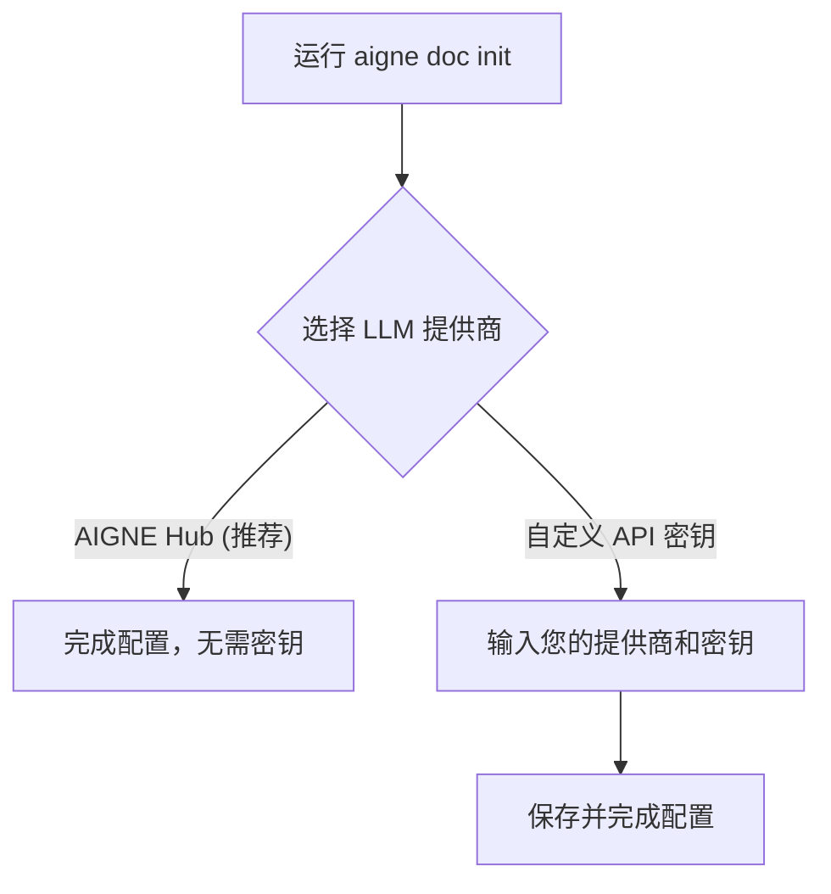

# AI模型提供商

AIGNE DocSmith 利用大型语言模型（LLM）来生成和优化文档内容。为了提供灵活性，DocSmith 支持多种 LLM 提供商，让您可以根据需求选择最合适的模型服务。

## AIGNE Hub (推荐)

AIGNE Hub 是我们推荐的默认 LLM 提供商。它是一个集成的服务，旨在简化 AI 模型的使用流程。

**主要优势：**
- **无需 API 密钥**：您无需申请和管理各大 AI 厂商的 API 密钥，可以直接使用 AIGNE Hub 提供的服务。
- **轻松切换模型**：可以在命令行中通过简单的参数，随时切换使用来自不同提供商的模型，如 Google、OpenAI、Anthropic 等。

### 使用方法

在使用 `generate` 或 `update` 等命令时，通过 `--model` 参数指定要使用的模型即可。这使您能够为不同的任务或文档选择最合适的模型。

**示例：**

```bash
# 使用 Google 的 Gemini 2.5 Flash 模型
aigne doc generate --model google:gemini-2.5-flash

# 使用 Anthropic 的 Claude 3.5 Sonnet 模型
aigne doc generate --model claude:claude-3-5-sonnet

# 使用 OpenAI 的 GPT-4o 模型
aigne doc generate --model openai:gpt-4o
```

## 自定义 API 密钥

除了 AIGNE Hub，DocSmith 也支持配置您自己的 API 密钥来使用 OpenAI、Anthropic 等模型提供商。如果您已经拥有这些服务商的账户并希望在自己的配额下使用，可以选择此方式。

您可以在运行 `aigne doc init` 命令启动的交互式配置向导中设置您的自定义 API 密钥。

## 配置方式

LLM 提供商的选择和配置是在初始化项目时通过交互式向导完成的。您可以随时运行 `aigne doc init` 来启动或修改配置。

配置流程如下：



无论您选择哪种方式，都可以在后续的命令中灵活地使用不同的模型。

---

完成模型提供商的配置后，您可以进一步了解 DocSmith 的多语言支持。请继续阅读 [支持的语言](./configuration-supported-languages.md) 以配置文档的翻译选项。