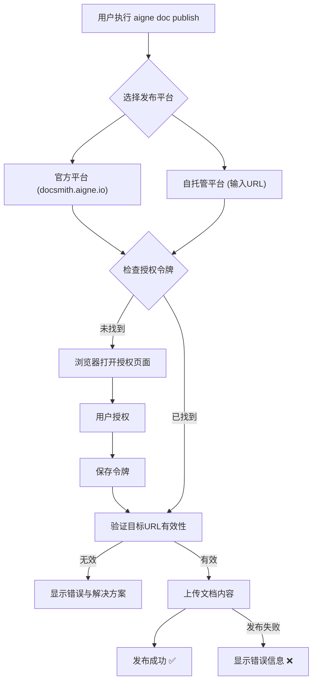

# 发布文档

文档生成后，下一步就是将其分享给您的目标读者。AIGNE DocSmith 提供了 `publish` 命令，让您可以轻松地将文档发布到公共平台或您自己的私有网站。

## 发布流程

通过一个简单的交互式命令，您可以指定发布目的地并将您的文档公之于众。

运行以下命令启动发布向导：

```bash
aigne doc publish
```

执行该命令后，系统会提示您选择一个发布平台。


### 发布平台选项

您可以根据项目的性质选择最合适的平台：

1.  **官方平台 (docsmith.aigne.io)**
    *   **描述**：这是一个免费的公共平台，非常适合开源项目或任何希望公开分享其文档的用户。
    *   **优点**：无需任何配置，即可快速发布。
    *   **注意**：发布到此平台的内容将对公众可见。

2.  **自托管平台**
    *   **描述**：如果您拥有自己部署的 Discuss Kit 实例，可以选择此项，将文档发布到您自己的网站上。
    *   **优点**：完全控制您的文档内容和访问权限。
    *   **操作**：选择此选项后，系统会提示您输入您网站的 URL。如果您尚未部署，可以参考 [Discuss Kit 文档](https://www.aigne.io/store/blocklet/z8ia2v13y1oJ4qg3rRk6wNAhE45s2CWJ513k9) 开始搭建。

### 直接发布

如果您想跳过交互式选择，可以直接通过 `--appUrl` 参数指定发布地址：

```bash
# 发布到您自己的 Discuss Kit 实例
aigne doc publish --appUrl https://your-discuss-kit-instance.com
```

## 授权与认证

首次发布到某个平台时，DocSmith 需要获得您的授权。这个过程是自动的，旨在确保安全发布。

1.  **令牌检查**：系统首先会检查本地是否已存有授权令牌（Access Token）。
2.  **浏览器授权**：如果未找到令牌，系统会自动打开一个浏览器窗口，引导您登录并授权 AIGNE DocSmith 访问您的 Discuss Kit 平台。
3.  **保存令牌**：授权成功后，访问令牌会被安全地保存在本地配置文件 `~/.aigne/doc-smith-connected.yaml` 中，供后续发布时自动使用，无需重复授权。

## 发布工作流

下面的图表展示了 `aigne doc publish` 命令的完整工作流程，从启动命令到成功发布文档。



## 配置保存

首次成功发布后，DocSmith 会自动将您选择的 `appUrl` 和系统生成的 `boardId`（文档板ID）保存到项目的 `aigne-doc.yaml` 配置文件中。这确保了后续更新时，文档会被发布到同一个位置，简化了维护工作。

---

现在您已经学会了如何发布文档，下一步可以探索如何通过提供反馈来[优化文档结构](./core-features-refine-structure.md)，使其更符合您的预期。