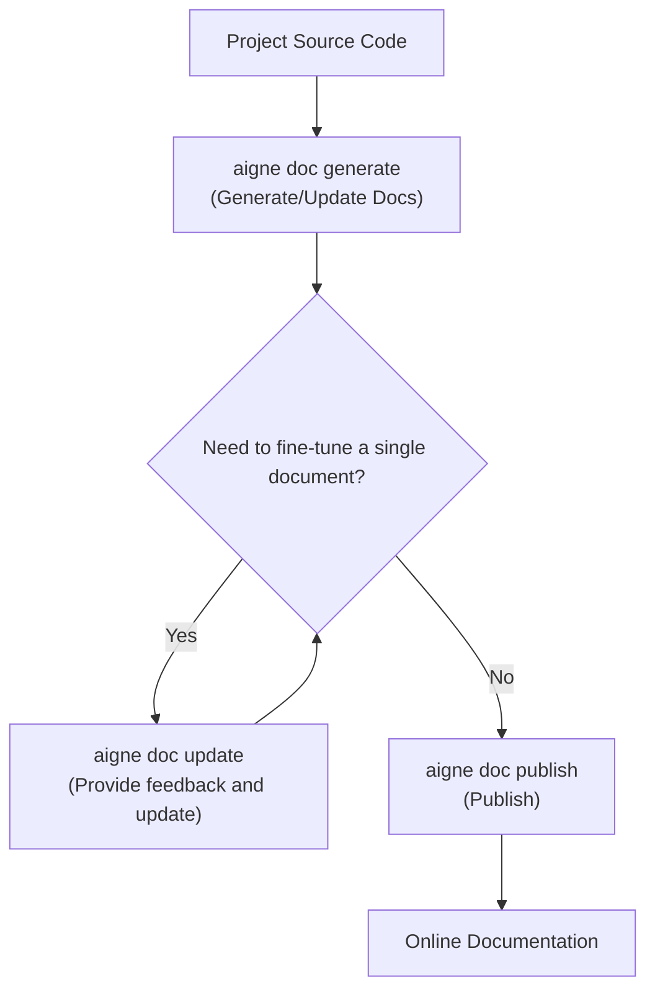

# Core Features

AIGNE DocSmith simplifies complex documentation workflows into a few core commands. With these instructions, you can easily navigate the entire process, from analyzing code and generating content to continuous optimization and final publication. This section provides an overview of these key features and guides you through the detailed usage of each command.

Here is the typical workflow for managing documentation using DocSmith:

## Generate Documents

With the `aigne doc generate` command, you can initiate the entire document creation process with a single command. DocSmith automatically analyzes your codebase, plans the document structure, and generates the initial content for all pages. This command serves as the starting point for your documentation efforts and is also used for full updates after significant code changes.

To learn how to use intelligent auto-configuration and forced regeneration options, refer to the detailed guide on [Generate Documents](./core-features-generate-docs.md).

## Update a Single Document

When you only need to fine-tune or optimize a specific document, the `aigne doc update` command is particularly useful. It allows you to select a specific document page and provide feedback to guide the AI in regenerating its content. This enables precise and efficient iteration without having to regenerate the entire project.

To learn how to optimize your content via the interactive menu or by directly specifying a path, visit [Update a Single Document](./core-features-update-document.md).

## Publish Documents

Once your documentation is complete, sharing it is a crucial step. The `aigne doc publish` command helps you easily publish the generated documents to the Discuss Kit platform. You can choose to publish to the official public platform at [docsmith.aigne.io](https://docsmith.aigne.io/app/) or deploy to your own private instance.

For detailed information on the publishing process and platform options, please see [Publish Documents](./core-features-publish-docs.md).

## Refine Document Structure

DocSmith's intelligent structure planning is highly effective, but you might still want to adjust it based on specific needs. By including the `--feedback` parameter with the `aigne doc generate` command, you can guide the AI in optimizing the overall document structure. For instance, you can add or remove sections and adjust the hierarchy to better match your project's requirements.

To master how to shape the ideal document outline through feedback, read [Refine Document Structure](./core-features-refine-structure.md).

---

Now that you have a basic understanding of DocSmith's core workflow, we recommend starting with [Generate Documents](./core-features-generate-docs.md) to experience the automated document creation process for yourself.