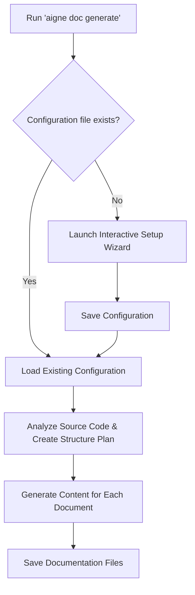

# Generate Documentation

The `aigne doc generate` command is the core of DocSmith. It automates the entire process of creating a complete documentation set by analyzing your source code, planning a logical structure, and then writing detailed content for each section. This process is designed to be both powerful and simple, often requiring just a single command.

## The Smart Generation Process

Running the `generate` command kicks off a multi-step process handled by AI agents. For the user, the experience is straightforward.

To start, navigate to your project's root directory and run:

```bash
aigne doc generate
```

### Automatic Configuration

If this is your first time running DocSmith in the project, it will intelligently detect that no configuration exists and automatically launch the interactive setup wizard. You don't need to run `aigne doc init` manually first. This ensures you have a proper setup before generation begins.


You will be guided through a series of questions to define the documentation's scope, style, target audience, and languages.


### Structure Planning and Content Creation

Once configured, DocSmith analyzes your source code to create a `structure-plan.json`. This file outlines the entire documentation hierarchy. Immediately after, it proceeds to generate the detailed Markdown content for each planned document.


Upon completion, you will find the generated files in your designated output directory, ready to be published.


### Generation Workflow

The entire workflow can be visualized as follows:



## Forcing a Complete Regeneration

By default, `aigne doc generate` is intelligent and will only update documents affected by code changes. If you need to discard all existing documentation and regenerate everything from scratch, use the `--forceRegenerate` flag.

This is useful after making significant changes to your configuration (`aigne.doc.yaml`) or when you want a completely fresh start.

```bash
# Regenerate all documentation based on the latest source code and configuration
aigne doc generate --forceRegenerate
```

## Refining the Structure with Feedback

You can guide the AI's structure planning by providing direct feedback. Use the `--feedback` flag with the `generate` command to suggest changes, additions, or removals to the documentation structure itself.

For example, if you want to add a more detailed installation guide, you could run:

```bash
# Regenerate the structure with specific improvements
aigne doc generate --feedback "Add more detailed installation guide and troubleshooting section"
```

DocSmith will take this feedback into account when it creates or updates the `structure-plan.json` file, leading to a more refined documentation outline.

---

Now that you have generated your documentation, the next steps are to keep it current or share it with your audience.

*   Learn how to make targeted changes in [Update and Refine](./features-update-and-refine.md).
*   To reach a global audience, see how to [Translate Documentation](./features-translate-documentation.md).
*   When you are ready to go live, follow the guide to [Publish Your Docs](./features-publish-your-docs.md).