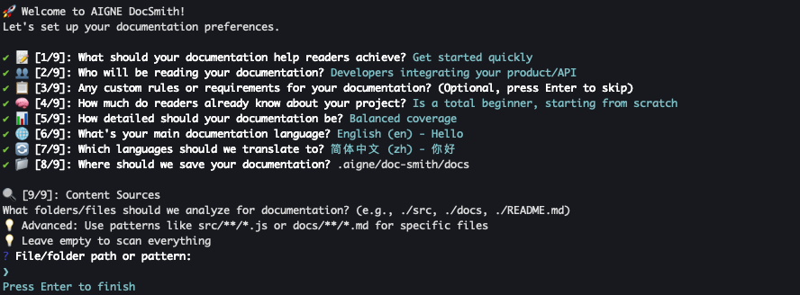

# Generate Documentation

The `aigne doc generate` command is the primary function for creating a complete documentation set from your source code. This command initiates a process that analyzes your codebase, plans a logical documentation structure, and then generates content for each section. It is the standard method for creating your documentation from an initial state.

## Your First Generation

To begin, navigate to your project's root directory and run the following command:

```bash aigne doc generate icon=lucide:play-circle
aigne doc generate
```

### Automatic Configuration

If you are running this command for the first time in a project, DocSmith will detect that no configuration exists. It will then automatically launch an interactive setup wizard to guide you through the required setup steps. This process ensures a valid configuration is in place before generation begins.


You will be prompted to answer a series of questions to define key aspects of your documentation, including:

*   Document generation rules and style
*   The target audience
*   Primary language and any additional translation languages
*   Source code input and documentation output paths



After the configuration is complete, DocSmith proceeds with the documentation generation.


Upon successful completion, the newly created documentation will be available in the output directory specified during setup.


## The Generation Process

The `generate` command executes an automated, multi-step workflow. The process is outlined below:

```d2
direction: down

User: {
  shape: c4-person
}

AIGNE-CLI: {
  label: "AIGNE CLI"

  config-check: {
    label: "Config file exists?"
    shape: diamond
  }

  interactive-setup: {
    label: "Interactive Setup Wizard"
  }

  generation-process: {
    label: "3. Generation Process"

    analyze-code: "Analyze Code"
    plan-structure: "Plan Structure"
    generate-content: "Generate Content"

    analyze-code -> plan-structure -> generate-content
  }

  output: {
    label: "Output Directory"
  }
}

User -> AIGNE-CLI.config-check: "'aigne doc generate'"
AIGNE-CLI.config-check -> AIGNE-CLI.interactive-setup: "[No] 2. Launch setup"
AIGNE-CLI.interactive-setup -> AIGNE-CLI.generation-process: "Create config file"
AIGNE-CLI.config-check -> AIGNE-CLI.generation-process: "[Yes]"
AIGNE-CLI.generation-process -> AIGNE-CLI.output: "4. Write documentation"
```

## Command Options

The default `generate` command is sufficient for most use cases. However, several options are available to modify its behavior, which can be useful for forcing a full regeneration or refining the documentation structure.

| Option              | Description                                                                                                                                    | Example                                                  |
| :------------------ | :--------------------------------------------------------------------------------------------------------------------------------------------- | :------------------------------------------------------- |
| `--forceRegenerate` | Deletes all existing documents and regenerates them from scratch. Use this after making significant changes to your source code or configuration. | `aigne doc generate --forceRegenerate`                   |
| `--feedback`        | Provides high-level feedback to refine the overall documentation structure, such as adding, removing, or reorganizing sections.                | `aigne doc generate --feedback "Add an API Reference"`   |
| `--model`           | Specifies a particular Large Language Model from AIGNE Hub to use for content generation, allowing you to switch between different models.       | `aigne doc generate --model openai:gpt-4o`               |

## What's Next?

After generating the initial documentation, your project will continue to evolve. To keep your documents synchronized with your code, you will need to perform updates. The next section explains how to make targeted changes and regenerate specific files based on new requirements or code modifications.

<x-card data-title="Update and Refine" data-icon="lucide:file-edit" data-href="/features/update-and-refine">Learn how to update documents when your code changes or make specific improvements using feedback.</x-card>