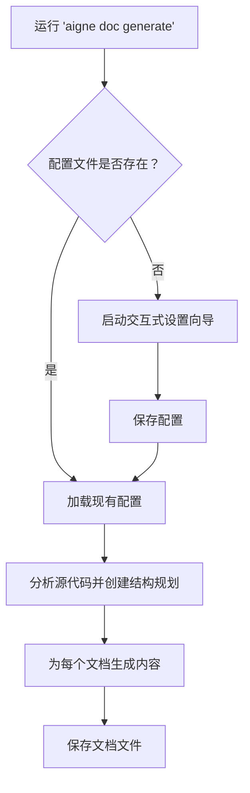

# 生成文档

`aigne doc generate` 命令是 DocSmith 的核心。它通过分析您的源代码、规划逻辑结构，然后为每个部分编写详细内容，从而自动化创建完整文档集的整个过程。该过程旨在做到既强大又简单，通常只需一个命令即可完成。

## 智能生成过程

运行 `generate` 命令会启动一个由 AI agent 处理的多步骤过程。对于用户而言，体验非常简单。

首先，请导航至您项目的根目录并运行：

```bash
aigne doc generate
```

### 自动配置

如果这是您首次在项目中运行 DocSmith，它会智能检测到尚无配置文件，并自动启动交互式设置向导。您无需预先手动运行 `aigne doc init`。这确保了在生成开始前，您已完成正确的配置。


系统将引导您回答一系列问题，以定义文档的范围、风格、目标受众和语言。


### 结构规划和内容创建

配置完成后，DocSmith 会分析您的源代码，以创建一个 `structure-plan.json` 文件。该文件概述了整个文档的层级结构。随后，它将立即为每个已规划的文档生成详细的 Markdown 内容。


完成后，您将在指定的输出目录中找到已生成的文件，这些文件可随时发布。


### 生成工作流程

整个工作流程可直观地表示如下：



## 强制完全重新生成

默认情况下，`aigne doc generate` 是智能的，仅会更新受代码变更影响的文档。如果您需要舍弃所有现有文档并从头开始重新生成所有内容，请使用 `--forceRegenerate` 标志。

当您对配置文件（`aigne.doc.yaml`）做出重大更改，或希望完全重新开始时，此功能非常有用。

```bash
# 基于最新的源代码和配置重新生成所有文档
aigne doc generate --forceRegenerate
```

## 通过反馈优化结构

您可以通过提供直接反馈来指导 AI 的结构规划。使用带 `--feedback` 标志的 `generate` 命令，可以建议对文档结构本身进行更改、添加或删除。

例如，如果您希望添加更详细的安装指南，可以运行：

```bash
# 重新生成结构并进行特定改进
aigne doc generate --feedback "添加更详细的安装指南和故障排除部分"
```

DocSmith 在创建或更新 `structure-plan.json` 文件时会采纳此反馈，从而生成更精炼的文档大纲。

---

既然您已经生成了文档，接下来的步骤就是保持其内容更新或与您的受众分享。

*   在 [更新与优化](./features-update-and-refine.md) 中了解如何进行针对性修改。
*   要覆盖全球受众，请参阅如何 [翻译文档](./features-translate-documentation.md)。
*   当您准备好上线时，请遵循指南 [发布您的文档](./features-publish-your-docs.md)。