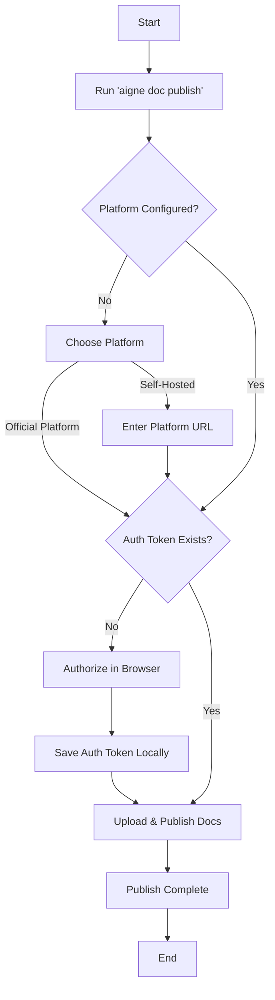

# Publish Your Docs

Once your documentation is generated locally, the final step is to publish it to a live website. AIGNE DocSmith streamlines this process, allowing you to publish to either the official, free AIGNE platform or your own self-hosted website with a single command.

## The Publishing Command

To begin the publishing process, run the following command in your project's root directory:

```bash
aigne doc publish
```

This command initiates an interactive wizard that will guide you through the necessary steps.

## Step 1: Choose Your Publishing Platform

If this is your first time publishing, you'll be prompted to choose where to host your documentation.


You have two options:

1.  **Official Platform (`docsmith.aigne.io`)**: This is the recommended choice for open-source projects. It's free to use, requires no setup, and your documentation will be publicly accessible.
2.  **Self-Hosted Platform**: If you need to host documentation on your own private website, you can select this option. This requires you to have your own instance of [Discuss Kit](https://docsmith.aigne.io) running. The wizard will then ask you to provide the URL of your instance.

## Step 2: One-Time Authorization

To publish documents on your behalf, the CLI needs your permission. The first time you publish to a new platform, a browser window will open, prompting you to authorize the AIGNE DocSmith application. This is a secure, one-time process.

Once authorized, an access token is saved securely on your local machine, so you won't need to repeat this step for subsequent publishes to the same platform.

## Step 3: Upload and Publish

After authorization is complete, the CLI will automatically upload your markdown files and associated media assets to the selected platform. It will then create or update the documentation board.

Once finished, the command will output a confirmation message and the URL where you can view your live documentation.

## Publishing Workflow

The following diagram illustrates the publishing and authorization flow:



## Non-Interactive Publishing

For automated environments like CI/CD pipelines, you can publish non-interactively by providing the application URL directly. Note that a valid access token must already be configured for this to work.

```bash
# Publish to a custom Discuss Kit instance
aigne doc publish --appUrl https://your-discuss-kit-instance.com
```

This bypasses the interactive prompts, making it suitable for scripts and automated workflows.

---

With your documentation published, you can share it with your audience. For a complete list of all commands and their options, proceed to the [CLI Command Reference](./cli-reference.md).