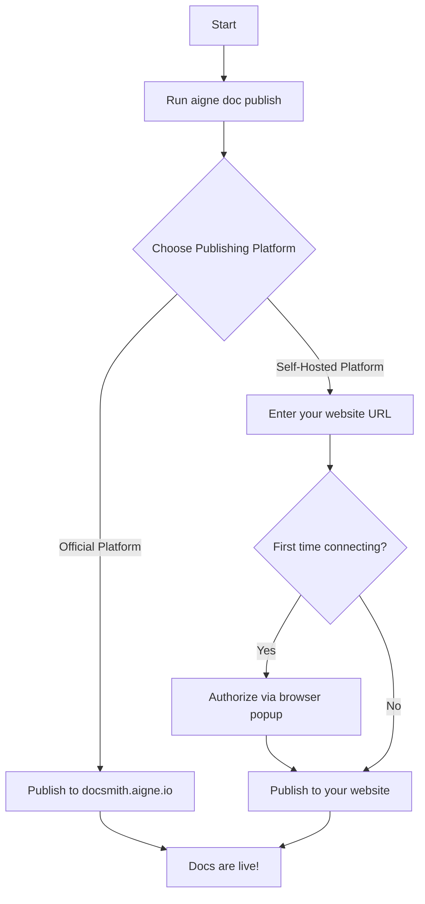

# Publish Your Docs

Once your documentation is generated, the final step is to make it accessible online. AIGNE DocSmith simplifies this process with a built-in publishing feature that uploads your content to a public platform or your own private website. This guide walks you through the `publish` command and its options.

## The Publishing Command

The primary command for publishing is `aigne doc publish`. When you run this command for the first time, it starts an interactive wizard to help you choose where to send your documentation.

```bash
aigne doc publish
```

Upon running the command, you will be presented with two main choices for your publishing destination.


### Option 1: Publish to the Official Platform

This is the simplest way to get your documentation online.

- **Platform URL**: `https://docsmith.aigne.io`
- **Best for**: Open-source projects, public-facing documentation.
- **Details**: This option is free to use. Your documentation will be publicly accessible. No server setup is required on your part.

### Option 2: Publish to a Self-Hosted Platform

This option gives you full control over where your documentation is hosted.

- **Best for**: Private company documentation, projects requiring custom branding or domains.
- **Details**: You will need to run your own instance of [Discuss Kit](https://store.blocklet.dev/blocklets/z8ia2v5Y71c2yDoA1Mi7QAv9pSjS2qAxg9KzL). The interactive prompt will ask you to enter the URL of your deployed Discuss Kit platform.

## The Publishing Process Flow

The publishing process is designed to be straightforward. The first time you connect to a new platform, you will be guided through a quick, one-time authorization step in your browser.



## Direct Publishing

If you want to bypass the interactive prompts, which can be useful for automated scripts or CI/CD pipelines, you can specify the application URL directly using the `--appUrl` flag.

```bash
# Publish directly to a custom Discuss Kit instance
aigne doc publish --appUrl https://your-docs-website.com
```

After a successful publication, DocSmith saves your `appUrl` and a unique `boardId` to your local configuration file. This means you won't have to select the platform or re-enter the URL on subsequent publishes.

---

With your documentation published, your users can now access it online. To learn about customizing the content and appearance, move on to the [Configuration Guide](./configuration.md).