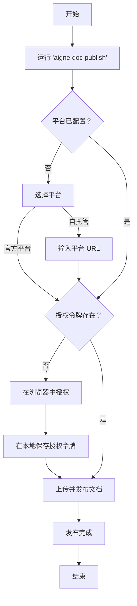

# 发布你的文档

在本地生成文档后，最后一步是将其发布到线上网站。AIGNE DocSmith 简化了此过程，允许你通过单个命令将文档发布到免费的 AIGNE 官方平台或你自己的自托管网站。

## 发布命令

要开始发布过程，请在项目的根目录中运行以下命令：

```bash
aigne doc publish
```

此命令会启动一个交互式向导，引导你完成必要的步骤。

## 第 1 步：选择你的发布平台

如果你是首次发布，系统将提示你选择文档的托管位置。


你有两个选择：

1.  **官方平台 (`docsmith.aigne.io`)**：这是开源项目的推荐选择。它免费使用，无需设置，并且你的文档将可以公开访问。
2.  **自托管平台**：如果你需要在自己的私有网站上托管文档，可以选择此选项。这要求你拥有一个正在运行的 [Discuss Kit](https://docsmith.aigne.io) 实例。然后，向导会要求你提供你的实例 URL。

## 第 2 步：一次性授权

为了能代表你发布文档，CLI 需要你的许可。当你首次发布到新平台时，浏览器将打开一个窗口，提示你授权 AIGNE DocSmith 应用程序。这是一个安全的一次性过程。

授权后，访问令牌会安全地保存在你的本地计算机上，因此后续发布到同一平台时无需重复此步骤。

## 第 3 步：上传和发布

授权完成后，CLI 将自动将你的 Markdown 文件及相关媒体资源上传到所选平台，然后创建或更新文档看板。

完成后，该命令会输出一条确认信息以及可用于查看线上文档的 URL。

## 发布工作流

下图说明了发布和授权的流程：



## 非交互式发布

对于 CI/CD 流水线等自动化环境，你可以通过直接提供应用程序 URL 来进行非交互式发布。请注意，要使其正常工作，必须已配置好有效的访问令牌。

```bash
# 发布到自定义 Discuss Kit 实例
aigne doc publish --appUrl https://your-discuss-kit-instance.com
```

这会绕过交互式提示，使其适用于脚本和自动化工作流。

---

文档发布后，你就可以与你的受众分享了。要获取所有命令及其选项的完整列表，请参阅 [CLI 命令参考](./cli-reference.md)。