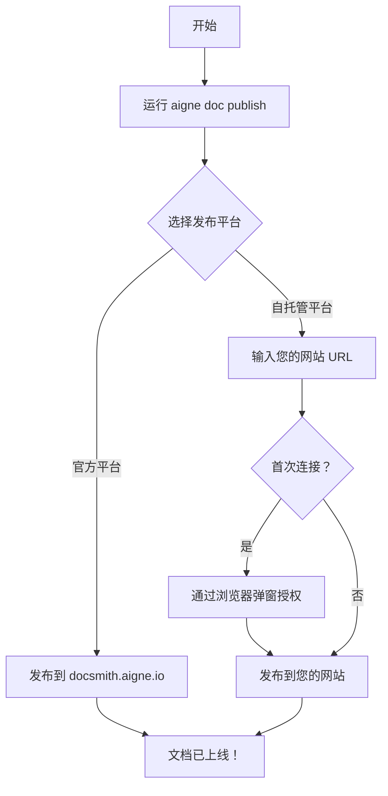

# 发布文档

文档生成后，最后一步是将其发布到线上，以便用户访问。AIGNE DocSmith 内置了发布功能，可将您的内容上传到公共平台或您自己的私有网站，从而简化了这一过程。本指南将详细介绍 `publish` 命令及其选项。

## 发布命令

用于发布的主要命令是 `aigne doc publish`。首次运行此命令时，系统会启动一个交互式向导，帮助您选择文档的发布位置。

```bash
aigne doc publish
```

运行该命令后，您将看到两个主要的发布目的地选项。


### 选项 1：发布到官方平台

这是将文档发布到线上的最简单方法。

- **平台网址**：`https://docsmith.aigne.io`
- **最适用于**：开源项目、面向公众的文档。
- **详细信息**：此选项可免费使用。您的文档将公开可见。您无需进行任何服务器设置。

### 选项 2：发布到自托管平台

此选项让您可以完全控制文档的托管位置。

- **最适用于**：公司内部私有文档、需要自定义品牌或域名的项目。
- **详细信息**：您需要运行自己的 [Discuss Kit](https://store.blocklet.dev/blocklets/z8ia2v5Y71c2yDoA1Mi7QAv9pSjS2qAxg9KzL) 实例。交互式提示将要求您输入已部署的 Discuss Kit 平台的 URL。

## 发布流程

发布流程设计得非常简单直观。首次连接到新平台时，系统将引导您在浏览器中完成一个快速的一次性授权步骤。



## 直接发布

如果您想跳过交互式提示（这在自动化脚本或 CI/CD 流水线中非常有用），可以使用 `--appUrl` 标志直接指定应用程序 URL。

```bash
# 直接发布到自定义的 Discuss Kit 实例
aigne doc publish --appUrl https://your-docs-website.com
```

成功发布后，DocSmith 会将您的 `appUrl` 和唯一的 `boardId` 保存到本地配置文件中。这意味着在后续发布时，您无需再次选择平台或重新输入 URL。

---

文档发布后，您的用户便可在线访问。如需了解如何自定义内容和外观，请继续阅读 [配置指南](./configuration.md)。