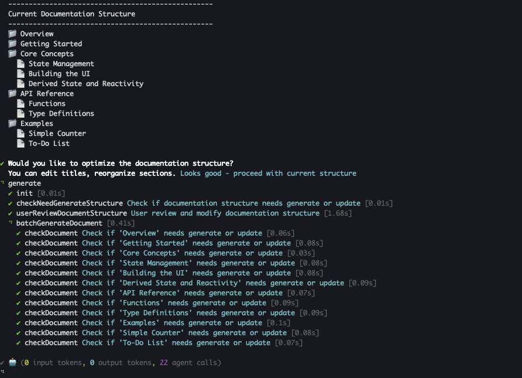

# 更新と改良

進化するコードベースとドキュメントを同期させることは、系統的なプロセスです。AIGNE DocSmith は、コードの変更に基づく自動更新、またはフィードバックに基づいた正確な改良を通じて、コンテンツを最新の状態に保つための直接的で柔軟なコマンドを提供します。

このガイドでは、以下のタスクの手順を説明します。

*   ソースコードが変更されたときにドキュメントを自動的に更新する。
*   ターゲットを絞ったフィードバックを使用して特定のドキュメントを再生成する。
*   ドキュメント全体の構造を調整する。

### ドキュメント更新ワークフロー

以下の図は、ドキュメントを更新するために利用可能なさまざまなワークフローを示しています。

```d2 ドキュメント更新ワークフロー
direction: down

Developer: {
  shape: c4-person
}

Source-Code: {
  label: "ソースコード"
}

Documentation: {
  label: "ドキュメント"
}

Action-Choice: {
  label: "アクションを選択"
  shape: diamond
}

Generate-Sync: {
  label: "aigne doc generate"
  shape: rectangle

  Change-Detection: {
    label: "変更を検出？"
    shape: diamond
  }
  Regenerate-Affected: "影響を受けるものを再生成"
  Regenerate-All: "すべてを再生成"

  Change-Detection -> Regenerate-Affected: "はい (デフォルト)"
  Change-Detection -> Regenerate-All: "いいえ\n(--forceRegenerate)"
}

Refine-Content: {
  label: "aigne doc update"
}

Refine-Structure: {
  label: "aigne doc generate\n--feedback"
}

Developer -> Action-Choice

Action-Choice -> Generate-Sync: "コードと同期"
Action-Choice -> Refine-Content: "ドキュメント内容を改良"
Action-Choice -> Refine-Structure: "ドキュメント構造を改良"

Source-Code -> Generate-Sync

Generate-Sync.Regenerate-Affected -> Documentation: "更新"
Generate-Sync.Regenerate-All -> Documentation: "更新"
Refine-Content -> Documentation: "更新"
Refine-Structure -> Documentation: "更新"
```

---

## 変更検出による自動更新

`aigne doc generate` コマンドを実行すると、DocSmith はまずコードベースを分析して、最後の生成以降の変更を検出します。次に、これらの変更によって影響を受けるドキュメントのみを再生成します。このデフォルトの動作により、冗長な操作を回避することで、時間を節約し、API の使用量を削減します。

```shell icon=lucide:terminal
# DocSmith が変更を検出し、必要なものだけを更新します
aigne doc generate
```



### 完全な再生成の強制

キャッシュと変更検出をバイパスして、すべてのドキュメントを最初から再生成するには、`--forceRegenerate` フラグを使用します。これは、大幅な設定変更を行った場合や、すべてのファイルで一貫性を確保するために完全な再構築が必要な場合に必要です。

```shell icon=lucide:terminal
# すべてのドキュメントをゼロから再生成する
aigne doc generate --forceRegenerate
```

---

## フィードバックによるドキュメントの改良

対応するコードの変更なしに、CLI コマンドに直接フィードバックを提供することでドキュメントを改良できます。これは、明確さを向上させたり、例を追加したり、構造を調整したりするのに役立ちます。

### 個別ドキュメント内容の改良

特定のドキュメントの内容を改善するには、`aigne doc update` コマンドを使用します。このコマンドを使用すると、改良のための具体的な指示を提供でき、インタラクティブモードと非インタラクティブモードの2つのモードで実行できます。

#### インタラクティブモード

ガイド付きのプロセスについては、引数なしでコマンドを実行します。DocSmith は、更新したいドキュメントを選択するためのメニューを表示します。選択後、フィードバックを入力するよう求められます。

```shell icon=lucide:terminal
# インタラクティブな更新プロセスを開始する
aigne doc update
```


#### 非インタラクティブモード

スクリプト化された、またはより高速なワークフローの場合、フラグを使用してドキュメントとフィードバックを直接指定できます。これにより、正確な非インタラクティブな更新が可能になります。

```shell icon=lucide:terminal
# 特定のドキュメントをフィードバックで更新する
aigne doc update --docs overview.md --feedback "最後に、より詳細な FAQ セクションを追加してください。"
```

`update` コマンドの主要なパラメータは次のとおりです。

| パラメータ | 説明 |
| :--- | :--- |
| `--docs` | 更新するドキュメントへのパス。このフラグはバッチ更新のために複数回使用できます。 |
| `--feedback` | ドキュメントのコンテンツを再生成する際に使用される具体的な指示を含む文字列。 |

### 全体構造の最適化

個々のドキュメントの改良に加えて、ドキュメント全体の構造を調整することもできます。既存の構成が最適でない場合やセクションが欠落している場合は、`generate` コマンドにフィードバックを提供できます。これにより、DocSmith はあなたの入力に基づいてドキュメントプラン全体を再評価するよう指示されます。

```shell icon=lucide:terminal
# 特定のフィードバックでドキュメント構造を再生成する
aigne doc generate --feedback "'概要'セクションを削除し、詳細な'APIリファレンス'を追加してください。"
```

このアプローチは、単一ファイル内のマイナーなコンテンツ編集ではなく、ドキュメントの目次に対する高レベルの変更を目的としています。

コンテンツが改良されたら、次のステップはそれを世界中の読者に向けて準備することです。手順については、[ドキュメントの翻訳](./features-translate-documentation.md)ガイドを参照してください。