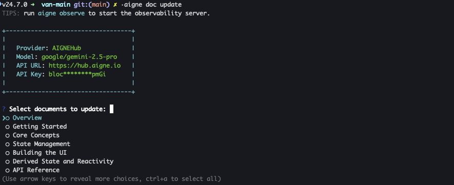

# 更新與完善

讓文件與不斷演進的程式碼庫保持同步是一個有條不紊的過程。AIGNE DocSmith 提供直接而靈活的指令，可透過基於程式碼變更的自動更新，或透過精確、由回饋驅動的完善方式，來讓您的內容保持最新狀態。

本指南提供以下任務的執行程序：

*   在原始碼修改時自動更新文件。
*   使用針對性的回饋重新生成特定文件。
*   調整整體文件結構。

### 文件更新工作流程

下圖說明了更新文件可用的不同工作流程：

```d2 文件更新工作流程
direction: down

Developer: {
  shape: c4-person
}

Source-Code: {
  label: "原始碼"
}

Documentation: {
  label: "文件"
}

Action-Choice: {
  label: "選擇操作"
  shape: diamond
}

Generate-Sync: {
  label: "aigne doc generate"
  shape: rectangle

  Change-Detection: {
    label: "偵測變更？"
    shape: diamond
  }
  Regenerate-Affected: "重新生成受影響的部分"
  Regenerate-All: "全部重新生成"

  Change-Detection -> Regenerate-Affected: "是 (預設)"
  Change-Detection -> Regenerate-All: "否\n(--forceRegenerate)"
}

Refine-Content: {
  label: "aigne doc update"
}

Refine-Structure: {
  label: "aigne doc generate\n--feedback"
}

Developer -> Action-Choice

Action-Choice -> Generate-Sync: "與程式碼同步"
Action-Choice -> Refine-Content: "完善文件內容"
Action-Choice -> Refine-Structure: "完善文件結構"

Source-Code -> Generate-Sync

Generate-Sync.Regenerate-Affected -> Documentation: "更新"
Generate-Sync.Regenerate-All -> Documentation: "更新"
Refine-Content -> Documentation: "更新"
Refine-Structure -> Documentation: "更新"
```

---

## 透過變更偵測自動更新

當您執行 `aigne doc generate` 指令時，DocSmith 會首先分析您的程式碼庫，以偵測自上次生成以來的變更。然後，它只會重新生成受這些變更影響的文件。這種預設行為透過避免多餘的操作來節省時間並減少 API 使用量。

```shell icon=lucide:terminal
# DocSmith 將偵測變更並僅更新必要部分
aigne doc generate
```


### 強制完整重新生成

若要從頭開始重新生成所有文件，繞過快取和變更偵測，請使用 `--forceRegenerate` 旗標。當您進行了重大的設定變更，或需要完全重建以確保所有檔案的一致性時，這項操作是必要的。

```shell icon=lucide:terminal
# 從頭開始重新生成所有文件
aigne doc generate --forceRegenerate
```

---

## 透過回饋完善文件

您可以透過向 CLI 指令提供直接回饋來完善文件，而無需對應的程式碼變更。這對於提高清晰度、新增範例或調整結構很有用。

### 完善個別文件內容

若要改善特定文件的內容，請使用 `aigne doc update` 指令。此指令允許您提供針對性的完善指示，並可以兩種模式運行：互動模式或非互動模式。

#### 互動模式

若要進行引導式流程，請在不帶任何參數的情況下執行該指令。DocSmith 將會顯示一個選單，讓您選擇要更新的文件。選擇後，系統將提示您輸入回饋。

```shell icon=lucide:terminal
# 啟動互動式更新流程
aigne doc update
```



#### 非互動模式

對於腳本化或更快速的工作流程，您可以使用旗標直接指定文件和回饋。這可以實現精確的非互動式更新。

```shell icon=lucide:terminal
# 使用回饋更新特定文件
aigne doc update --docs overview.md --feedback "Add a more detailed FAQ section at the end."
```

`update` 指令的主要參數如下：

| 參數 | 說明 |
| :--------- | :--------------------------------------------------------------------------------------------------- |
| `--docs` | 要更新的文件的路徑。此旗標可多次使用以進行批次更新。 |
| `--feedback` | 一個包含在重新生成文件內容時要使用的具體說明的字串。 |

### 優化整體結構

除了完善個別文件外，您還可以調整整體文件結構。如果現有組織結構不理想或缺少某個部分，您可以向 `generate` 指令提供回饋。這會指示 DocSmith 根據您的輸入重新評估整個文件計畫。

```shell icon=lucide:terminal
# 使用特定回饋重新生成文件結構
aigne doc generate --feedback "Remove the 'About' section and add a detailed 'API Reference'."
```

此方法旨在對文件目錄進行高層次的變更，而非對單一檔案內的次要內容進行編輯。

一旦您的內容完善後，下一步就是為全球受眾做好準備。有關說明，請參閱 [翻譯文件](./features-translate-documentation.md) 指南。