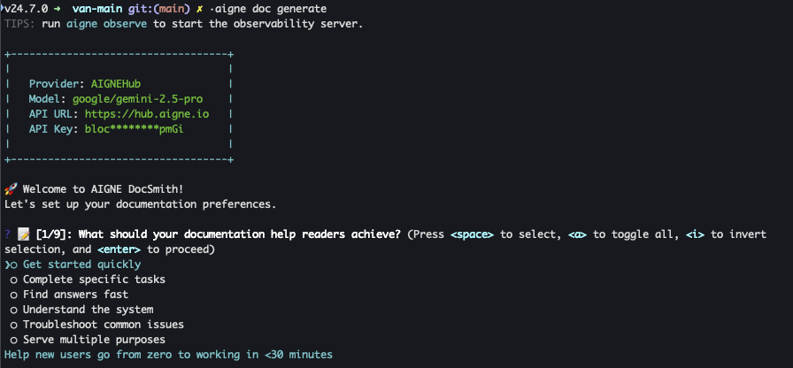
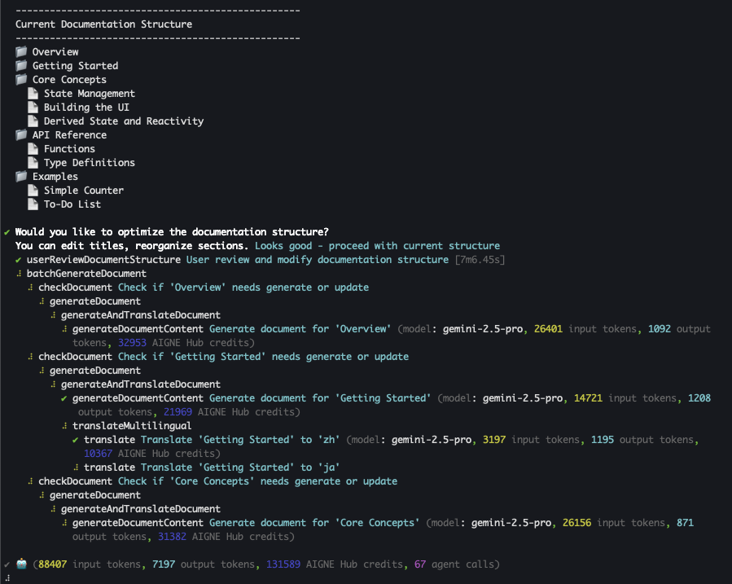

# ドキュメントの生成

このガイドでは、`generate` コマンドを使用して、プロジェクトの新しいドキュメントセットを作成するためのステップバイステップのプロセスを説明します。これは、ソースファイルを最初から最後まで構造化されたドキュメントセットに変換するために使用される主要なコマンドです。

生成プロセスは体系的かつ対話形式で設計されており、最終的な出力がプロジェクトの特定のニーズを確実に満たすようになっています。

## 生成プロセス

`aigne doc generate` を実行すると、ツールは体系的なプロセスに従ってドキュメントを作成します。以下に各ステップの内訳を示します。

### ステップ1：生成の開始

開始するには、ターミナルでプロジェクトのルートディレクトリに移動し、コアコマンドを実行します。

```bash title="ターミナル" icon=lucide:terminal
aigne doc generate
```

この単一のコマンドで、ドキュメント作成のワークフロー全体が開始されます。このコマンドを初めて実行する場合、対話形式のセットアッププロセスが表示されます。



### ステップ2：コード分析と構造計画

まず、DocSmithはソースコードを分析し、その構造、コンポーネント、および関係性を理解します。この分析に基づいて、初期のドキュメント構造を提案します。この計画は、トピックを論理的な階層に整理し、プロジェクトのコンテンツに合わせて「はじめに」、「ガイド」、「APIリファレンス」などのドキュメントを含む場合があります。

### ステップ3：対話形式での構造レビュー

初期構造が計画された後、ターミナルでそのレビューを求められます。これは、コンテンツが書き込まれる前にドキュメントの構成を調整できる重要なステップです。

構造をそのまま承認するか、平易な言葉でフィードバックを提供して変更を加えることができます。



提供できるフィードバックの例：

*   ドキュメントのタイトルを変更する（例：「はじめに」を「クイックスタート」に変更）。
*   「トラブルシューティング」のための新しいドキュメントを追加する。
*   不要なドキュメントを削除する。

ツールはあなたのフィードバックを適用し、更新された構造を再度レビューのために提示します。構造があなたの要件と完全に一致するまで、このプロセスを繰り返すことができます。

### ステップ4：コンテンツの作成

最終的な構造を承認すると、DocSmithは各ドキュメントの詳細なコンテンツの生成に進みます。関連するソースファイルを読み込み、計画されたすべてのドキュメントに対して、明確な説明、コード例、および記述を書き込みます。このプロセスは、承認された計画内のすべてのドキュメントに対して実行されます。

### ステップ5：完了

プロセスが完了すると、ドキュメントが正常に生成されたことを示す確認メッセージが表示されます。出力ファイルは、設定で指定されたディレクトリ（デフォルトは `./docs`）に配置されます。


## コマンドオプション

オプションのフラグを使用することで、`generate` コマンドの動作を変更できます。これらのフラグにより、生成プロセスをより詳細に制御できます。

| オプション | 説明 |
| --------------------- | ------------------------------------------------------------------------------------------------------------------------------------------------------------------------- |
| `--forceRegenerate` | 既存のファイルをすべて無視して、すべてのドキュメントを最初から再作成します。これは、ソースコードに大幅な変更を加えた場合や、完全に新しいビルドが必要な場合に便利です。 |
| `--glossary <path>` | 用語集ファイルを指定します（例：`--glossary @glossary.md`）。これにより、生成されるすべてのドキュメントで技術用語が定義され、一貫して使用されることが保証されます。 |

### 使用例

以下に、コマンドとそのオプションの使用方法を示すいくつかの例を示します。

**標準的な生成**
これは、最初のドキュメントセットを作成するための最も一般的な使用例です。
```bash title="ターミナル" icon=lucide:terminal
aigne doc generate
```

**強制的な再生成**
既存のすべてのドキュメントを破棄して完全に再構築する必要がある場合に、このコマンドを使用します。
```bash title="ターミナル" icon=lucide:terminal
aigne doc generate --forceRegenerate
```

**用語集の使用**
一貫した用語を保証するために、用語集ファイルへのパスを指定します。
```bash title="ターミナル" icon=lucide:terminal
aigne doc generate --glossary @./glossary.md
```

## まとめ

これで、プロジェクトのソースファイルからドキュメントを生成する完全なプロセスを学びました。このワークフローには、コマンドの開始、提案された構造の対話形式でのレビュー、そしてツールによるコンテンツの書き込みが含まれます。

ドキュメントを生成した後、次のステップとして、[特定のドキュメントを更新](./guides-updating-documentation.md)して新しい情報を追加したり、[ドキュメントを公開](./guides-publishing-your-docs.md)してオーディエンスがアクセスできるようにしたりすることが考えられます。