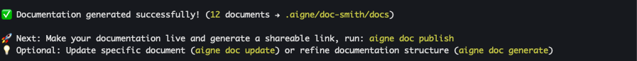

# 產生文件

本指南將引導您使用單一指令，從專案的原始檔案建立一套完整的文件。此流程設計得簡單明瞭，從初始分析到最終內容產生，並包含一個互動式審查步驟，以確保輸出結構完全符合您的需求。

## 產生流程

當您執行 `aigne doc generate` 時，該工具會執行一系列步驟來分析您的專案並產生文件。本節將對該工作流程進行事實性分解。

### 步驟 1：啟動指令

此流程始於在您專案的根目錄中執行 `generate` 指令。此指令會協調從分析到內容建立的整個工作流程。

```bash Terminal icon=lucide:terminal
aigne doc generate
```

為求效率，您也可以使用別名 `gen` 或 `g`。

### 步驟 2：原始碼分析與結構規劃

啟動後，DocSmith 會對您專案的原始檔案進行分析。它會識別程式碼庫中的元件、邏輯和關係，以提出一個初步的文件結構。此計畫會概述一個文件的邏輯層級，例如「概覽」、「入門指南」和「API 參考」，並根據偵測到的內容進行客製化。

### 步驟 3：互動式結構審查

在初步結構規劃完成後，它會顯示在終端機中供您審查。此步驟讓您可以在任何內容被寫入之前，批准或修改文件組織。

您有兩個選項：
1.  **接受結構：** 如果提議的組織結構令人滿意，您可以批准它以繼續。
2.  **提供回饋以進行優化：** 您可以輸入純文字指令來修改結構。


回饋範例如下：
*   「將『Getting Started』重新命名為『Quick Start』。」
*   「新增一份名為『Troubleshooting』的文件。」
*   「將『API Reference』移至『Guides』區段下。」

該工具會根據您的回饋修訂結構，並再次呈現給您審查。此迭代過程會持續進行，直到結構符合您的要求。

### 步驟 4：內容產生

一旦文件結構最終確定並獲得批准，DocSmith 就會開始為計畫中的每份文件產生內容。它會處理相關的原始檔案，以撰寫詳細的解釋和程式碼範例。此操作會對每份文件執行，確保根據批准的結構進行完整覆蓋。

### 步驟 5：完成

在所有文件產生完畢後，終端機中會顯示一則確認訊息。輸出檔案會儲存到您設定中指定的目錄，預設為 `./docs`。



## 指令選項

`generate` 指令包含可選的旗標以控制其行為。這些旗標允許在產生過程中執行更具體的動作。

| 選項 | 描述 |
| :--- | :--- |
| `--forceRegenerate` | 從原始檔案重建所有文件，覆寫任何現有文件。這在程式碼有重大變更後進行全面刷新時很有用。 |
| `--glossary <path>` | 指定詞彙表檔案的路徑（例如 `@glossary.md`）。使用詞彙表可確保關鍵術語在整個文件中保持一致。 |

### 範例：強制重新產生

若要捨棄現有文件並從頭開始產生一套新的文件，請使用 `--forceRegenerate` 旗標。

```bash Terminal icon=lucide:terminal
aigne doc generate --forceRegenerate
```

### 範例：使用詞彙表

為保持術語一致性，請提供一個詞彙表檔案的路徑。

```bash Terminal icon=lucide:terminal
aigne doc generate --glossary @./project-glossary.md
```

## 總結

本指南詳細介紹了產生一套新文件的系統流程。工作流程從指令啟動和原始碼分析開始，接著是互動式結構審查，然後是內容建立。

文件產生後，您可以繼續 [更新現有文件](./guides-updating-documentation.md) 或 [發布您的文件](./guides-publishing-your-docs.md)。