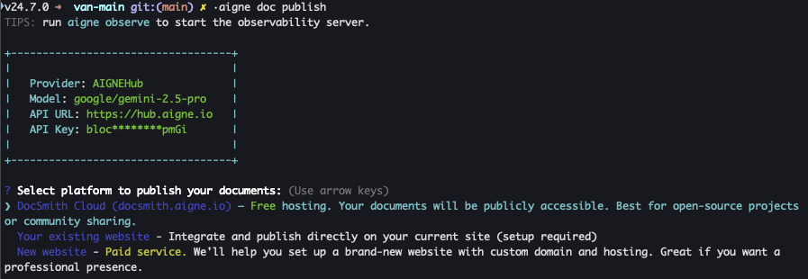

# 發佈您的文件

文件產生後，最後一步是將其發佈到網路上。本文件提供了如何使用 `aigne doc publish` 命令發佈文件的逐步指南，讓您的讀者可以存取這些文件。

## publish 命令

`aigne doc publish` 命令會將您產生的文件檔案上傳到網路服務，讓使用者可以在網頁瀏覽器中查看。為了提高效率，您可以使用主命令或其較短的別名。

```bash 命令別名 icon=lucide:terminal
# 完整命令
aigne doc publish

# 簡短別名
aigne doc pub

# 更短的別名
aigne doc p
```

首次執行此命令將啟動一個互動式設定流程，引導您為您的文件選擇一個發佈平台。



## 發佈選項

該工具提供多個託管您文件的目的地。在互動式設定過程中，您將看到以下選項。

### 1. DocSmith Cloud（免費託管）

此選項會將您的文件發佈到 `docsmith.aigne.io`，這是 AIGNE 提供的免費公共託管服務。

*   **最適用於**：開源專案、個人作品集或任何旨在供公眾存取的文件。
*   **費用**：免費。
*   **結果**：您的文件將託管在一個公開的 URL 上，成功發佈後會提供該 URL。

### 2. 您現有的網站（自行託管）

此選項允許您將文件發佈到您已擁有並營運的網站。這需要您執行自己的 Discuss Kit 實例，該實例提供了文件網站所需之後端和前端元件。

*   **最適用於**：將文件直接整合到現有公司網站、產品入口網站或個人網域中，以實現完全控制。
*   **要求**：您必須擁有自己的託管環境。
*   **步驟**：
    1.  在提示中選擇「您現有的網站」選項。
    2.  輸入您網站的完整 URL（例如 `https://docs.your-company.com`）。
    3.  若要設定您自己的文件網站，您可以從官方商店取得 Discuss Kit 實例：[https://www.web3kit.rocks/discuss-kit](https://www.web3kit.rocks/discuss-kit)。

### 3. 新網站（付費服務）

此選項透過引導式流程，協助您為文件建立一個新的專用網站。

*   **最適用於**：需要專業、獨立的文件入口網站但不想自行管理設定的使用者。
*   **費用**：這是一項付費服務。
*   **步驟**：命令列工具將引導您完成部署和設定一個新的、受管理的 Discuss Kit 實例所需的步驟。如果您先前已開始此流程，將會提供一個恢復設定的選項。

## CI/CD 的自動化發佈

在持續整合/持續部署（CI/CD）管線等自動化環境中，您可以使用 `--appUrl` 旗標直接指定目的地 URL，從而繞過互動式提示。

```bash 直接發佈 icon=lucide:terminal
aigne doc publish --appUrl https://your-docs-website.com
```

當您首次發佈到特定 URL 時，無論是透過互動式提示還是 `--appUrl` 旗標，該工具都會將此 URL 儲存到您的本地設定檔中。後續執行 `aigne doc publish` 時，將自動使用已儲存的 URL，從而簡化更新流程。

## 疑難排解

### 授權錯誤（401/403）

如果發佈過程中失敗，並出現包含「401」或「403」的錯誤訊息，這通常表示您的驗證權杖有問題。該權杖可能無效、已過期，或缺乏對指定文件板的必要權限。

若要解決此問題，您可以使用 `clear` 命令重設您的本地驗證憑證。

```bash 清除設定 icon=lucide:terminal
aigne doc clear
```

此命令將提示您選擇要移除的設定資料。選擇清除驗證權杖。之後，再次執行 `aigne doc publish`。系統將提示您重新進行身份驗證，這將產生一個新的有效權杖，讓發佈得以繼續。

---

成功發佈文件後，您需要隨著專案的發展保持文件更新。有關如何修改現有文件的說明，請參閱[更新文件](./guides-updating-documentation.md)指南。