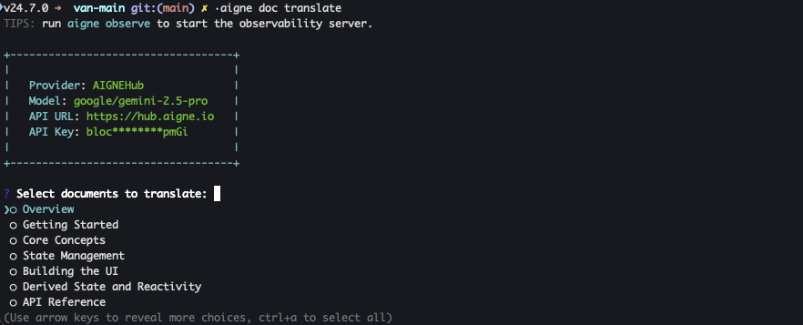
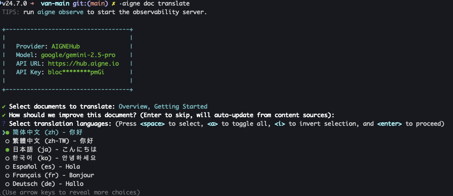

# Translating Documentation

DocSmith enables you to translate your documentation into multiple languages, making your content accessible to a global audience. The translation process is designed to be straightforward, leveraging AI to provide context-aware and technically accurate translations. This guide details the steps to translate your documents using the `translate` command.

DocSmith supports professional translation for 12 languages, ensuring broad coverage for international users.

## How to Translate Documents

The primary command for translation is `aigne doc translate`. You can run it interactively to select which documents and languages you want, or you can specify these options directly using command-line flags for automated workflows.

### Interactive Mode

For a guided experience, simply run the command without any arguments.

```bash
aigne doc translate
```

The tool will prompt you to:
1.  **Select the documents** you wish to translate from a list of your existing documentation.
2.  **Choose the target languages** for the translation. Previously selected languages will be pre-checked for convenience.



After selecting the documents, you will be presented with a list of available languages.



Once you confirm your selections, DocSmith will proceed with the translation for each document into each selected language.

### Command-Line Usage

For more direct control or for use in scripts, you can use flags to specify your requirements.

```bash
aigne doc translate [options]
```

#### Options

The following options are available for the `translate` command:

<x-field-group>
  <x-field data-name="--docs" data-type="array" data-required="false">
    <x-field-desc markdown>Specify one or more document paths to translate. If not provided, you will be prompted to select from a list interactively.</x-field-desc>
  </x-field>
  <x-field data-name="--langs" data-type="array" data-required="false">
    <x-field-desc markdown>Specify one or more target language codes (e.g., `zh`, `ja`). If not provided, you can select languages interactively.</x-field-desc>
  </x-field>
  <x-field data-name="--glossary" data-type="string" data-required="false">
    <x-field-desc markdown>Path to a glossary file (e.g., `@/path/to/glossary.md`) to ensure consistent terminology across all translations.</x-field-desc>
  </x-field>
  <x-field data-name="--feedback" data-type="string" data-required="false">
    <x-field-desc markdown>Provide specific instructions or feedback to guide the AI's translation style (e.g., "Use a formal tone and keep technical terms in English"). This feedback is recorded in the document's history.</x-field-desc>
  </x-field>
</x-field-group>

#### Example

To translate the `overview.md` and `getting-started.md` documents into Chinese and Japanese, you would run the following command:

```bash
aigne doc translate --docs /overview.md --docs /getting-started.md --langs zh ja
```

To provide stylistic feedback and ensure consistent terminology, you can add the `--feedback` and `--glossary` flags:

```bash
aigne doc translate --docs /overview.md --langs de --feedback "Use a formal tone" --glossary @/path/to/glossary.md
```

## Supported Languages

DocSmith provides professional translation for the following 12 languages. Use the corresponding code when specifying languages via the `--langs` flag.

| Language | Code |
|---|---|
| English | `en` |
| 简体中文 | `zh` |
| 繁體中文 | `zh-TW` |
| 日本語 | `ja` |
| 한국어 | `ko` |
| Español | `es` |
| Français | `fr` |
| Deutsch | `de` |
| Português | `pt` |
| Русский | `ru` |
| Italiano | `it` |
| العربية | `ar` |

## Summary

You have now learned how to use the `aigne doc translate` command to make your documentation available in multiple languages, either through an interactive process or by using command-line options for automation.

After translating your documents, the next logical step is to make them available to your users. For instructions on how to do this, please refer to the [Publishing Your Docs](./guides-publishing-your-docs.md) guide.