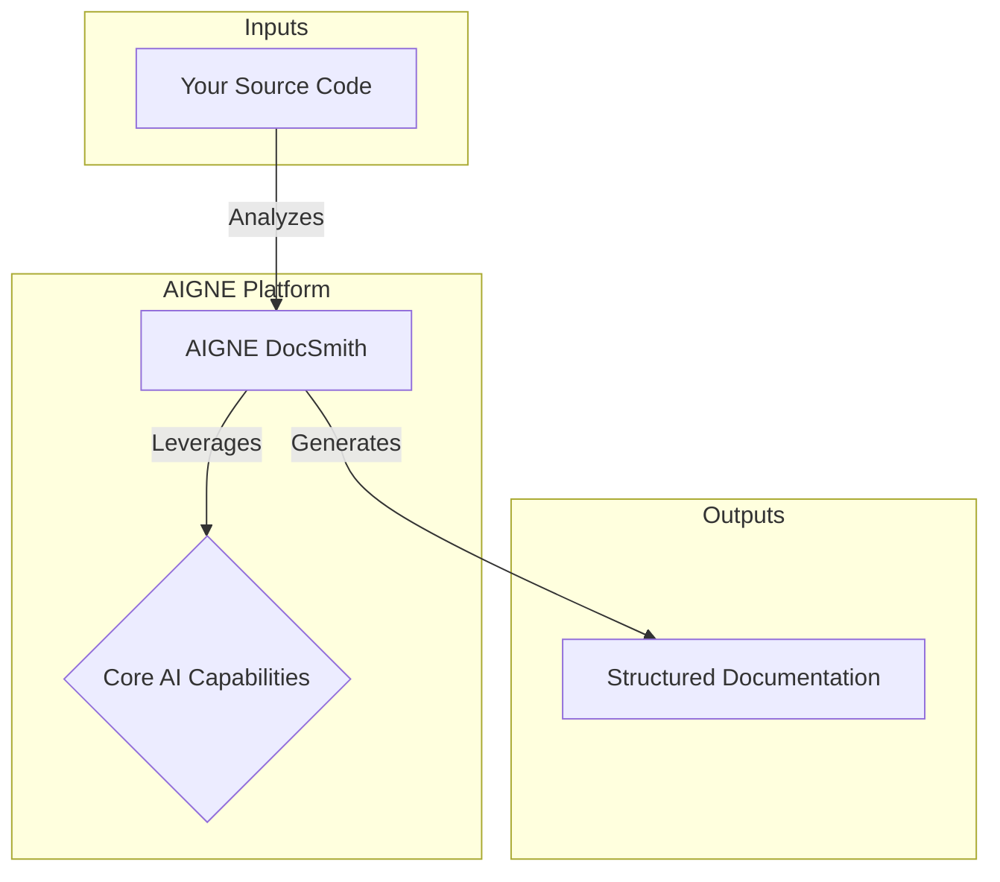

# Overview

AIGNE DocSmith is an AI-driven documentation generation tool built on the [AIGNE Framework](https://www.aigne.io/en/framework). It automates the creation of detailed, structured, and multi-language documentation directly from your source code, simplifying the entire process for developers and teams.

## The AIGNE Ecosystem

DocSmith is a component of the comprehensive [AIGNE](https://www.aigne.io) ecosystem, an AI application development platform. It integrates with other AIGNE tools, leveraging the platform's central AI capabilities and infrastructure to deliver its features.

The diagram above illustrates how DocSmith fits into the broader AIGNE architecture. The integration allows for a consistent and streamlined development experience across different tools within the ecosystem.

## Key Features

DocSmith offers a range of features designed to make documentation effortless and maintainable.

| Feature | Description |
|---|---|
| **Automated Structure Planning** | Intelligently analyzes your codebase to generate a comprehensive and logical document structure. |
| **AI-Powered Content Generation** | Populates the document structure with detailed, high-quality content based on the source code. |
| **Multi-Language Support** | Translates your documentation into 12+ languages, including Chinese, Japanese, Spanish, and German. |
| **AIGNE Hub Integration** | Connects to AIGNE Hub, allowing you to use various LLMs without managing your own API keys. |
| **Discuss Kit Publishing** | Publishes documentation directly to the official platform or your own self-hosted Discuss Kit instance. |
| **Document Update Mechanism** | Automatically detects source code changes and updates the relevant sections of your documentation. |
| **Individual Document Optimization** | Allows you to regenerate and refine specific documents with targeted feedback for continuous improvement. |

This overview provides a starting point for understanding what AIGNE DocSmith can do. To start using the tool and create your first set of documents, proceed to the next section.

[Next: Getting Started](./getting-started.md)