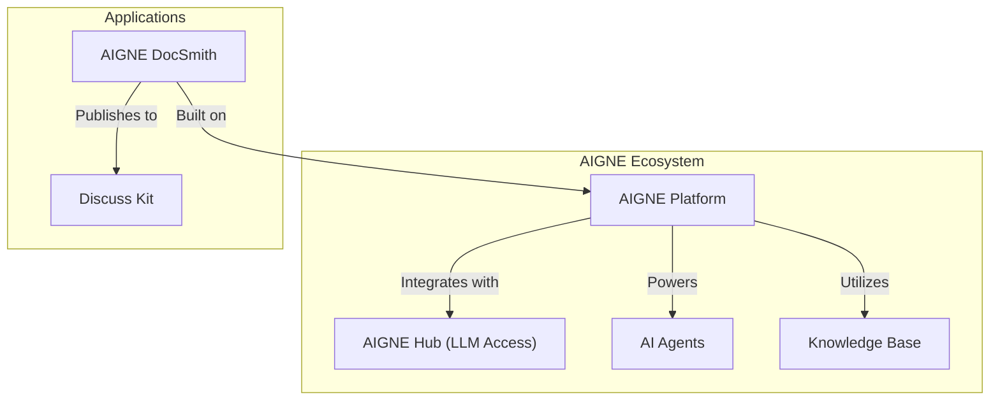

# Overview

AIGNE DocSmith is an AI-driven documentation generation tool built on the [AIGNE Framework](https://www.aigne.io/en/framework). It automates the creation of detailed, structured, and multi-language documentation directly from your source code. This approach helps keep your content synchronized with your project as it evolves.

## Key Features

DocSmith provides a set of features to streamline the documentation process:

- **Automated Structure Planning:** Analyzes your codebase to generate a logical document structure.
- **AI-Powered Content Generation:** Populates the planned structure with detailed, high-quality content.
- **Multi-Language Support:** Translates your documentation into more than 12 languages, including English, Chinese, Spanish, and French.
- **AIGNE Hub Integration:** Allows you to use various large language models through AIGNE Hub without needing to configure individual API keys.
- **Discuss Kit Publishing:** Publishes documentation directly to the official [docsmith.aigne.io](https://docsmith.aigne.io/app/) platform or your own self-hosted instance.
- **Document Update Mechanism:** Detects source code changes and updates the corresponding documentation to reflect them.
- **Individual Document Optimization:** Lets you regenerate specific documents with targeted feedback for continuous improvement.

## The AIGNE Ecosystem

DocSmith operates as part of the broader AIGNE ecosystem, a platform designed for building and deploying AI applications. It integrates with other AIGNE components to leverage the platform's shared AI capabilities and infrastructure.

The following diagram illustrates how DocSmith fits within the overall architecture:

As the diagram shows, DocSmith utilizes the core AIGNE platform and its components, like AIGNE Hub for language model access, and can publish its output to a Discuss Kit instance.

## Next Steps

Now that you have an idea of what DocSmith offers, the best way to learn more is to install it and generate your first set of documents.

Ready to begin? Proceed to the [Getting Started](./getting-started.md) guide.