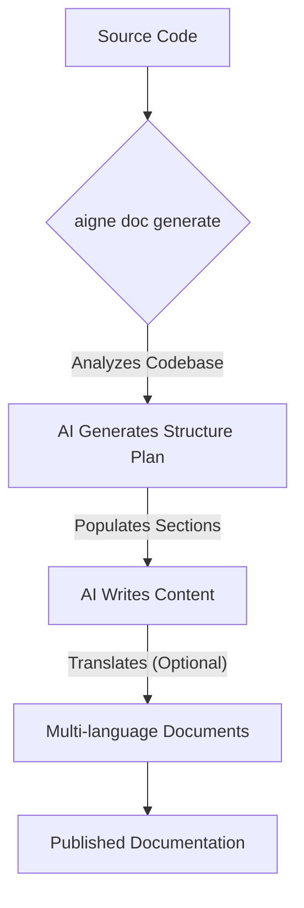

# Overview

AIGNE DocSmith is an AI-driven tool that automates the creation of detailed, structured, and multi-language documentation directly from your source code. It is built on the AIGNE Framework and designed to help developers produce and maintain high-quality documentation with minimal effort.

## How It Fits in the AIGNE Ecosystem

DocSmith is a key component of the [AIGNE](https://www.aigne.io) ecosystem, a comprehensive platform for AI application development. It integrates with other AIGNE components to leverage the platform's core AI capabilities and infrastructure, enabling advanced features like flexible LLM integration through AIGNE Hub and direct publishing to Discuss Kit.

## Key Features

DocSmith simplifies the entire documentation lifecycle with a set of focused features:

*   **Automated Structure Planning:** Analyzes your codebase to propose a comprehensive and logical document structure.
*   **AI-Powered Content Generation:** Populates the planned structure with detailed, high-quality content written by AI.
*   **Multi-Language Support:** Translates your documentation into over 12 languages, including Chinese, Spanish, French, and German.
*   **AIGNE Hub Integration:** Use various large language models (LLMs) from providers like OpenAI, Google, and Anthropic without managing individual API keys.
*   **Document Update Mechanism:** Detects changes in your source code and intelligently updates the relevant sections of your documentation.
*   **Publishing to Discuss Kit:** Publish your generated documentation to the official [docsmith.aigne.io](https://docsmith.aigne.io/app/) platform or your own self-hosted instance.

## The Generation Process

The documentation process is streamlined into a few automated steps, transforming your source code into a complete set of documents.

Ready to begin? Follow the [Getting Started](./getting-started.md) guide to install the CLI and generate your first set of documents.