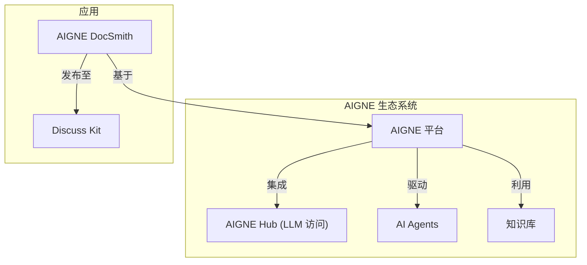

# 概述

AIGNE DocSmith 是一款基于 [AIGNE 框架](https://www.aigne.io/en/framework) 构建的 AI 驱动型文档生成工具。它可以直接根据您的源代码，自动创建结构清晰、内容详尽的多语言文档。这种方法有助于确保您的文档内容与项目演进保持同步。

## 主要功能

DocSmith 提供了一系列功能来简化文档编写流程：

- **自动化结构规划：** 分析您的代码库，生成逻辑清晰的文档结构。
- **AI 驱动的内容生成：** 在规划好的结构中填充内容详尽、质量上乘的文档。
- **多语言支持：** 可将您的文档翻译成超过 12 种语言，包括英语、中文、西班牙语和法语。
- **AIGNE Hub 集成：** 允许您通过 AIGNE Hub 使用各种大语言模型，无需配置单独的 API 密钥。
- **Discuss Kit 发布：** 可将文档直接发布到官方 [docsmith.aigne.io](https://docsmith.aigne.io/app/) 平台或您自己的自托管实例。
- **文档更新机制：** 能够检测源代码的变更，并相应地更新文档内容。
- **单个文档优化：** 允许您根据特定反馈重新生成单个文档，从而实现持续改进。

## AIGNE 生态系统

DocSmith 作为更广泛的 AIGNE 生态系统的一部分运行，该生态系统是一个专为构建和部署 AI 应用而设计的平台。它与其他 AIGNE 组件集成，以利用平台共享的 AI 功能和基础设施。

下图展示了 DocSmith 在整个架构中的位置：

如图所示，DocSmith 利用核心的 AIGNE 平台及其组件（如用于访问语言模型的 AIGNE Hub），并可将其输出发布到 Discuss Kit 实例。

## 后续步骤

既然您已经对 DocSmith 的功能有了一定的了解，那么学习它的最佳方式就是亲自安装并生成您的第一份文档。

准备好开始了吗？请继续阅读[入门指南](./getting-started.md)。