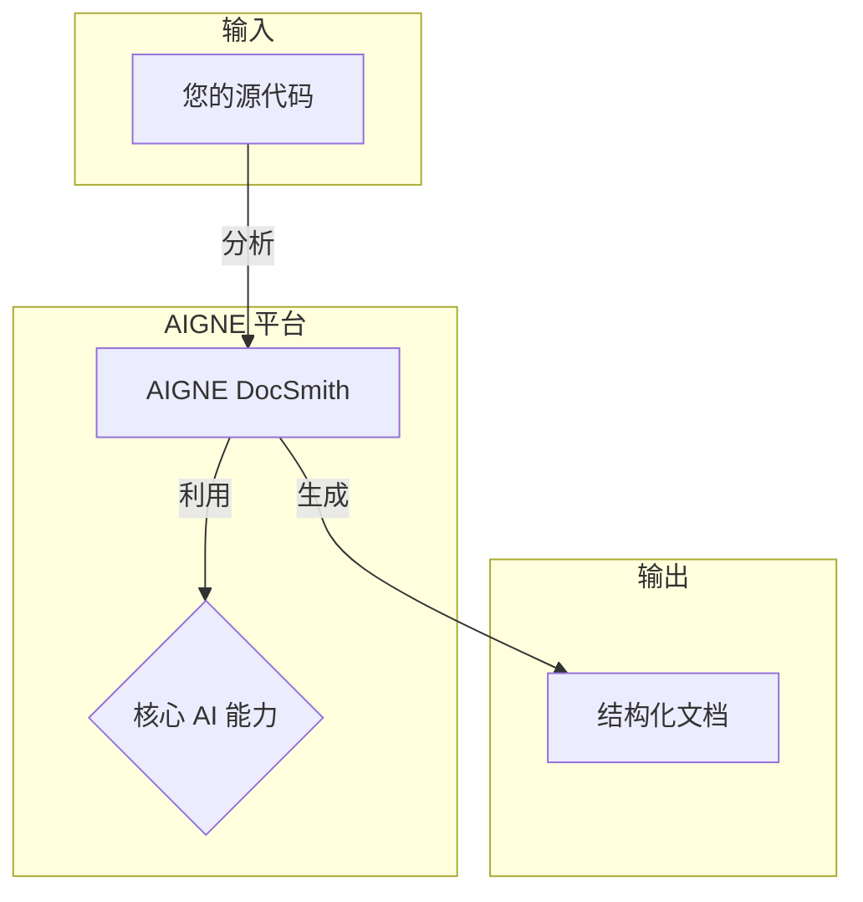

# 概述

AIGNE DocSmith 是一款基于 [AIGNE 框架](https://www.aigne.io/en/framework) 构建的人工智能驱动的文档生成工具。它能够直接从您的源代码中自动创建详细、结构化和多语言的文档，从而为开发者和团队简化整个流程。

## AIGNE 生态系统

DocSmith 是综合性 [AIGNE](https://www.aigne.io) 生态系统（一个 AI 应用开发平台）的组成部分。它与其他 AIGNE 工具集成，利用平台的核心 AI 能力和基础设施来实现其功能。

上图展示了 DocSmith 如何融入更广泛的 AIGNE 架构中。这种集成使得在生态系统内的不同工具之间能够获得一致且简化的开发体验。

## 主要特性

DocSmith 提供了一系列功能，旨在使文档编写和维护变得轻松便捷。

| 特性 | 描述 |
|---|---|
| **自动化结构规划** | 智能分析您的代码库，生成全面且逻辑清晰的文档结构。 |
| **AI 驱动的内容生成** | 根据源代码，用详细、高质量的内容填充文档结构。 |
| **多语言支持** | 将您的文档翻译成 12 种以上语言，包括中文、日语、西班牙语和德语。 |
| **AIGNE Hub 集成** | 连接到 AIGNE Hub，让您无需管理自己的 API 密钥即可使用各种 LLM。 |
| **Discuss Kit 发布** | 将文档直接发布到官方平台或您自己托管的 Discuss Kit 实例。 |
| **文档更新机制** | 自动检测源代码变更，并更新文档的相关部分。 |
| **单篇文档优化** | 允许您通过有针对性的反馈重新生成和优化特定文档，以实现持续改进。 |

本概述为您了解 AIGNE DocSmith 的功能提供了一个起点。要开始使用该工具并创建您的第一组文档，请继续下一部分。

[下一篇：开始使用](./getting-started.md)