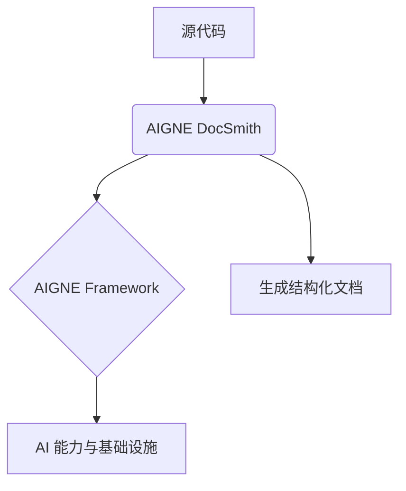

# 概览

AIGNE DocSmith 是一款基于 [AIGNE 框架](https://www.aigne.io/en/framework) 构建的 AI 驱动的文档生成工具。它可以直接从您的源代码中，自动创建结构清晰、内容详尽且支持多种语言的专业文档，旨在极大简化技术文档的编写与维护流程。

## DocSmith 在 AIGNE 生态中的位置

DocSmith 是 [AIGNE](https://www.aigne.io) 生态系统的一部分，这是一个全面的 AI 应用开发平台。它与其他 AIGNE 组件无缝集成，充分利用了平台强大的 AI 能力和基础设施。

以下图表演示了 DocSmith 在整个工作流程中的核心位置：

## 主要功能

DocSmith 提供了一系列功能，旨在全方位自动化文档的创建与维护过程。

| 功能 | 描述 |
| --- | --- |
| **自动结构规划** | 智能分析您的代码库，生成一份全面且逻辑清晰的文档结构。 |
| **AI 内容生成** | 基于已规划的结构，自动填充详细、高质量的文档内容。 |
| **多语言支持** | 可将您的文档无缝翻译成包括中文、英文、日文在内的12种以上语言。 |
| **AIGNE Hub 集成** | 无需自有 API 密钥即可使用 AIGNE Hub 作为 LLM 提供商，并轻松切换不同的大型语言模型。 |
| **Discuss Kit 发布** | 支持将文档发布到官方平台或您自行部署的 Discuss Kit 实例。 |
| **文档更新机制** | 自动检测源代码的变更，并相应地更新文档内容。 |
| **单篇文档优化** | 允许针对特定文档，通过提供反馈来进行内容的重新生成和优化。 |

## 下一步

通过本节，您已经对 AIGNE DocSmith 的核心概念和功能有了初步了解。现在，您可以开始实际操作了。

请继续阅读 [快速入门](./getting-started.md) 指南，它将引导您完成安装，并在几分钟内生成您的第一份文档。