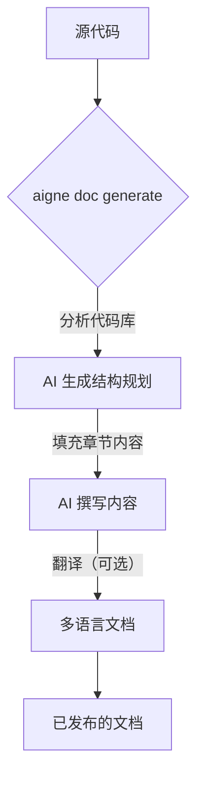

# 概述

AIGNE DocSmith 是一款 AI 驱动的工具，可直接根据源代码自动创建详细、结构化且支持多语言的文档。它基于 AIGNE 框架构建，旨在帮助开发者以最少的工作量生成和维护高质量的文档。

## 如何融入 AIGNE 生态系统

DocSmith 是 [AIGNE](https://www.aigne.io) 生态系统的关键组成部分，该生态系统是用于 AI 应用开发的综合平台。它与其他 AIGNE 组件集成，利用平台的核心 AI 功能和基础设施，以实现诸如通过 AIGNE Hub 灵活集成 LLM 以及直接发布到 Discuss Kit 等高级功能。

## 主要功能

DocSmith 通过一系列核心功能简化了整个文档生命周期：

*   **自动化结构规划：** 分析您的代码库，提出全面且逻辑清晰的文档结构。
*   **AI 驱动的内容生成：** 利用 AI 撰写详细、高质量的内容，填充已规划的文档结构。
*   **多语言支持：** 可将您的文档翻译成超过 12 种语言，包括中文、西班牙语、法语和德语。
*   **集成 AIGNE Hub：** 无需管理独立的 API 密钥，即可使用来自 OpenAI、Google 和 Anthropic 等提供商的多种大型语言模型 (LLM)。
*   **文档更新机制：** 检测源代码中的变更，并智能地更新文档的相关部分。
*   **发布至 Discuss Kit：** 将生成的文档发布到官方 [docsmith.aigne.io](https://docsmith.aigne.io/app/) 平台或您自己托管的实例。

## 生成流程

文档生成流程被简化为几个自动化步骤，可将您的源代码转换成一套完整的文档。

准备好开始了吗？请遵循 [入门指南](./getting-started.md) 安装 CLI 并生成您的第一套文档。